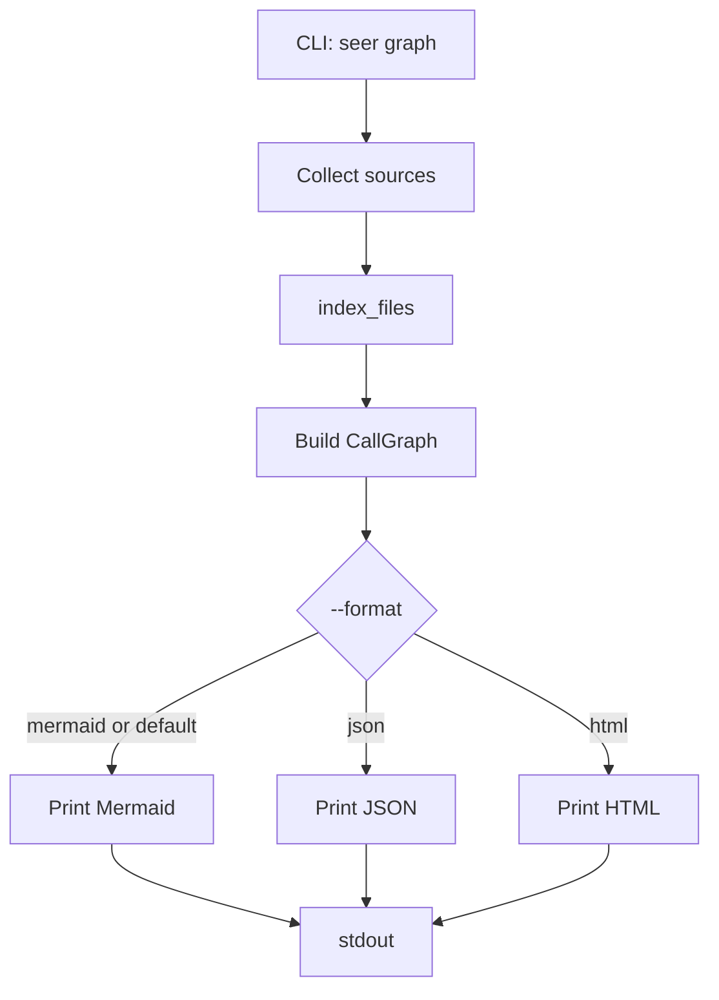

# Seer Call Graph

| Field | Value |
|---|---|
| **Title** | Seer: call graph (in-memory IR; Mermaid, JSON, HTML printers) |
| **Author** | Stefan Mihai Stanescu / project Seer |
| **Date** | 2026-08-31 |
| **Status** | Draft |
| **License** | MIT (existing `LICENSE` in the repo) |
| **Repo** | https://github.com/MajorScruffy/seer |
| **Audience** | Implementing agents and reviewers. This document is the behavior oracle for `seer graph`. |
| **Depends on** | [spec.md](spec.md) for collect, parse, extract, omit, resolve, entry selection, CLI exit codes, and `--max-lines` |

This file lives at `docs/graph.md`. Paths below are relative to the repo root. `cargo test` is the merge gate: if this document and a test disagree, fix this document.

**How to use this document.** Every implementable claim has a check. Do not invent node ids, Mermaid shape, JSON key order, or the HTML JSON embed. Tree and outline-diff stay as [spec.md](spec.md). If a graph behavior is not in this file, it is either forbidden in this slice or listed under [Open Questions](#open-questions).

---

## Overview

Seer already indexes a call graph: unique `FnDef`s plus `CallSite`s that resolve to `FnId`s. Tree mode unfolds that graph into a spanning tree and copies a callee under every site. This command prints the graph **without unfolding**.

The IR is an in-memory `CallGraph`. JSON is the owned text form of that graph (process boundary, goldens, HTML payload). Mermaid is a printer. HTML is a printer that embeds the JSON and draws it; it must not parse Mermaid.

v1 of this slice is `seer graph [PATH]` on the same analyzed set as `seer tree`. No git revisions, no HTTP server, no GPUI, no TUI graph, no graph diff.

Success is byte-identical stdout against the golden fixtures in [Verification](#verification), plus `cargo test` exit 0.

---

## Background and motivation

A diamond `a→b, a→c, b→d, c→d` is one `d` in the index and two copies in a tree. Reviewers who want sharing need the graph, not a second unfold mode.

Constraints that drive the design:

- **Reuse the index.** Collect, parse, extract, omit, and resolve stay in [spec.md](spec.md). Graph code must call `index_files` and `resolve`. It must not call `outline` / expand.
- **In-memory graph is the IR.** JSON is a serialization for goldens and the HTML page. Mermaid is not parsed.
- **Call graph only.** Control headers (`if`, `for`, `match`) stay in the tree outline. They are not graph nodes in this slice.
- **Deterministic text.** Same input bytes and same analyzed set → identical stdout for Mermaid and JSON.

Pain of alternatives: a TUI cannot lay out shared nodes. GPUI is a second native UI stack (pre-1.0, GPU, not the seer-view TUI). Dumping Mermaid as the only format locks later UI to a drawing grammar.

---

## Goals and non-goals

### Goals

1. Build a call graph from the existing `ResolveIndex`.
2. One node per body-bearing function (`FnId`). One node per unique unresolved call display (leaf).
3. One JSON edge per kept call site. Mermaid and HTML draw one arrow per unique `(from, to)` pair.
4. Omit the same logging and debug APIs as [spec.md](spec.md).
5. Print Mermaid by default. Print JSON with `--format json`. Print a self-contained HTML viewer with `--format html`.
6. Same input → byte-identical Mermaid and JSON stdout on every run.

### Non-goals (this slice)

- HTTP server, `--open`, writing graph files, or a CDN.
- GPUI or any native GUI crate.
- TUI graph drawing. `seer-view` stays an outline-diff viewer.
- Graph diff of two revisions.
- Git blob collect (`seer graph` is tree-like: path, directory, or stdin).
- Control-flow graphs inside a function.
- DOT / Graphviz printer.
- Changing tree, diff, omit, or resolve behavior.
- `--format` on `tree` or `diff` (still forbidden by [spec.md](spec.md) Open Question 2).

---

## Key decisions

| Decision | Choice | Rationale |
|---|---|---|
| IR | In-memory `CallGraph` | Build once; printers borrow it. |
| JSON | Owned text form of the same graph | Goldens, `--format json`, HTML payload. |
| Default stdout | Mermaid `flowchart TD` | Terminal and existing Mermaid viewers. |
| `--format html` | Self-contained page embedding JSON | Web GUI without a server. Opens in a browser after redirect to a file. |
| `--format json` | Second printer of the same graph | Machines and the HTML payload. |
| Nodes | All body-bearing defs, including nested fns | The index already has them. Nested is never an entry, but it is a node. |
| Signatures | No node | No body. Same as tree: not an entry, not an expand target. |
| Edges | From the enclosing `FnDef`, not from control nodes | Flat call graph. `if item.valid()` does not create an edge. `wrap(inner())` is two edges from the caller. |
| NestedFn in a body | Skip when walking edges | Inner calls live on the inner `FnDef`. A definition is not a call. |
| Resolved call | Edge to that `FnId` | Shared node is the point of the feature. |
| Unresolved / macro (kept) | Edge to a leaf keyed by display | Same snippet merges. `cross_file_no_search` keeps `handle()` leaf distinct from `fn handle`. |
| Omit | No edge, no leaf | Same `should_omit_resolved` as expand. |
| Recursion | Self-edge (or back-edge to an existing node) | No `[recursive]` suffix. The graph has cycles. |
| Diamond | Two edges into one `d` | Locked by the diamond golden. |
| Duplicate sites | Two JSON edges, one Mermaid/HTML arrow | JSON keeps sites. Drawings show sharing. |
| Entries | `entry` on function nodes from `select_entries` | Layout hint. Mermaid does not mark entries. HTML lists them in a filter. |
| Locations | Function nodes carry `file` + `line` (1-based) | Agents jump. Leaves have no loc. |
| Collect | Same as `seer tree PATH` | One code path. |
| Color | Never in Mermaid/JSON stdout | HTML is a dark theme. |

---

## Proposed design

### Pipeline



**Check:** Graph construction never clones a function body under a call. `d` appears once in `nodes` when two callers resolve to it.

### Crate layout (additions)

Do not create a workspace. Add:

```
src/graph.rs                 # CallGraph, build, print_mermaid, print_json, print_html
src/graph.css                # HTML viewer stylesheet (include_str)
src/graph.js                 # Canvas 2D viewer + layout (include_str)
tests/fixtures/graph/<name>/ # golden mermaid and json
```

`src/cli.rs` gains `Cmd::Graph`. `src/lib.rs` exports `graph_files`. Do not add `src/expand.rs`. Do not add a web crate. Do not add `serde_json` unless a golden cannot be matched by a hand-rolled printer. The goldens are law.

### Analyzed set

Same table as [spec.md](spec.md) **Analyzed set** for tree mode:

| Invocation | Analyzed set |
|---|---|
| `seer graph FILE.rs` (or `.java` / `.ts` / `.tsx` / `.mts` / `.cts`) | That file only |
| `seer graph DIR` | All collected source files under `DIR` |
| `seer graph -` or `seer graph` with stdin piped | One virtual file named `<stdin>` |

Git collect is out of scope. `seer graph` with no path on a tty is exit 2 (same as `seer tree` with no path on a tty).

### CallGraph IR

```rust
pub struct CallGraph {
    pub nodes: Vec<GraphNode>,
    pub edges: Vec<GraphEdge>,
}

pub enum GraphNode {
    Function {
        id: String,      // "{file}:{start_byte}"
        name: String,
        file: String,
        line: usize,     // 1-based
        entry: bool,
    },
    Leaf {
        id: String,      // "leaf:{display}"
        label: String,   // site.display
    },
}

pub struct GraphEdge {
    pub from: String,    // function node id
    pub to: String,      // function or leaf id
    pub label: String,   // site.display
}
```

`GraphNode` is an encoding of the printed JSON. Production code can keep `start_byte` on function nodes for sorting. The JSON shape in [JSON printer](#json-printer) is law.

### Build

Inputs: `ResolveIndex` from `index_files`. Use `resolve`, `should_omit_resolved`, and `select_entries` / `called_functions` as in `src/resolve.rs`. Do not fork omit or resolve.

```
build(index) -> CallGraph:
    entries = select_entries(index, called_functions(index))
    nodes = []
    edges = []
    seen_ids = set

    for def in index.defs:
        if not def.has_body: continue
        id = "{def.id.file}:{def.id.start_byte}"
        nodes.push Function { id, name, file, line, entry: entries contains def.id }
        seen_ids.add(id)

    for def in index.defs:
        if not def.has_body: continue
        from = "{def.id.file}:{def.id.start_byte}"
        walk_edges(def.body, from, index, nodes, edges, seen_ids)

    sort nodes
    sort edges
    return CallGraph { nodes, edges }

walk_edges(raws, from, ...):
    for raw in raws:
        match raw:
            Control { children }: walk_edges(children, from, ...)
            NestedFn { .. }: continue
                # do not walk children. inner FnDef owns those calls.
            Call { site }:
                uses = index.uses[site.file]
                target = resolve(site, index)
                if should_omit_resolved(site, uses, target.is_some()): continue
                if target is Some(id):
                    to = "{id.file}:{id.start_byte}"
                else:
                    to = "leaf:{site.display}"
                    if to not in seen_ids:
                        nodes.push Leaf { id: to, label: site.display }
                        seen_ids.add(to)
                edges.push { from, to, label: site.display }
```

`file` in ids is the same POSIX string as `FnId.file` ([spec.md](spec.md) **Analyzed set**). No URL-encoding. A `:` in a leaf display stays as written.

**NestedFn:** a nested `fn inner` is a Function node because `index_defs` records it. The parent body still has a `Call` `inner()` when the parent calls it. That call becomes an edge. The `NestedFn` raw node itself is not an edge.

**Check:** `nested_fn` has nodes `outer`, `inner`, `other`, `unused` and one resolved edge `outer → inner`. No edge from `other` to `unused`.

### Sort (normative)

After build, before print:

1. **Nodes:** function nodes first, then leaf nodes.
   - Functions: `(file, start_byte)` ascending. `file` is UTF-8 byte order (`str` comparison). `start_byte` is the integer in the id after the last `:`. Parse `start_byte` from the id suffix, not from a hidden field, if the printer only sees strings. Implementations that still have `FnId` sort by `FnId` directly (same order).
   - Leaves: `id` string, UTF-8 byte order.
2. **Edges:** `(from, to, label, seq)` lexicographic, UTF-8 byte order.

**Check:** Two runs hash to one digest. `call_in_let` JSON has two edges `f → compute` with label `compute()`, adjacent after sort.

### Mermaid printer

Empty graph (`nodes` empty): empty string, **zero bytes**.

Non-empty:

```
flowchart TD
  n0["<label0>"]
  n1["<label1>"]
  ...
  nI --> nJ
  ...
```

Rules:

- First line: `flowchart TD` then `\n`.
- Node id in Mermaid is `n{i}` where `i` is the 0-based index in the **sorted** `nodes` array (`n0`, `n1`, …).
- Function label: `{file}:{line} {name}` (one space). Example: `input.rs:1 process`.
- Leaf label: `label` as stored (already collapsed + `strip_std` on the call display).
- Escape in labels: replace each `"` with `'`. No other escaping in this slice. Labels come from collapsed source, so they have no newline.
- After every node line, print edges. One Mermaid arrow per unique `(from, to)` pair, in first-seen order while scanning **sorted** edges (skip a pair if already printed). The arrow is `  {fromMermaid} --> {toMermaid}` with two leading spaces.
- No edge labels in Mermaid in this slice (JSON keeps `label`).
- Each line ends with `\n`. No trailing blank line after the last line. No subgraphs, no `click`, no classDef, no color, no `---` comments.

Self-edge: `  n0 --> n0` when `from == to`.

**Check:** `recursive` contains `n0 --> n0`. `diamond` has four function nodes and four arrows, one of them into `d` from `b` and one from `c`.

#### Normative Mermaid: `process_handle`

Analyzed set is `tests/fixtures/tree/process_handle/input.rs` (CLI path as given, or fixture harness path `input.rs`). Fixture harness uses `input.rs`.

```
flowchart TD
  n0["input.rs:1 process"]
  n1["input.rs:13 handle"]
  n2["fs::write(path, data)"]
  n3["serde_json::to_string(item)"]
  n0 --> n1
  n1 --> n2
  n1 --> n3
```

`log::warn` is omitted. `items.is_empty()`, `item.valid()`, and `item.ready()` are not call nodes (headers). `handle` is one node. Leaves sort as `leaf:fs::write(path, data)` then `leaf:serde_json::to_string(item)`.

When the CLI prints a tree of that file, `FnId.file` is the argv path, so labels use that path, not `input.rs`. The golden for `tests/fixtures.rs` uses `input.rs`. The CLI test uses the argv path. Same split as tree goldens vs `cli_tree_subcommand`.

#### Normative Mermaid: `diamond` (`input.rs`)

```
flowchart TD
  n0["input.rs:1 a"]
  n1["input.rs:6 b"]
  n2["input.rs:10 c"]
  n3["input.rs:14 d"]
  n0 --> n1
  n0 --> n2
  n1 --> n3
  n2 --> n3
```

Line numbers must match `line_of` on those `function_item`s in `tests/fixtures/tree/diamond/input.rs`. If a golden disagrees with `line_of`, fix the golden.

#### Normative Mermaid: `recursive` (`input.rs`)

```
flowchart TD
  n0["input.rs:1 walk"]
  n1["node.child()"]
  n0 --> n0
  n0 --> n1
```

Self-edge from `walk(node.child())`. `node.child()` is a kept argument call (leaf).

#### Normative Mermaid: `cross_file_no_search` (paths `a.rs`, `b.rs`)

```
flowchart TD
  n0["a.rs:1 process"]
  n1["b.rs:1 handle"]
  n2["handle()"]
  n3["todo!()"]
  n0 --> n2
  n1 --> n3
```

Unqualified `handle()` in `a.rs` does not resolve. Leaf `handle()` is not the function node `b.rs handle`. `todo!()` is a kept macro leaf.

### JSON printer

Empty graph: empty string, **zero bytes**.

Non-empty: UTF-8 JSON object, pretty-printed with **2-space** indent, `\n` newlines, **one trailing `\n` at EOF**, no BOM.

Root keys in this order: `nodes`, then `edges`.

Each function node object, keys in this order:

```json
{
  "id": "input.rs:0",
  "kind": "function",
  "name": "process",
  "file": "input.rs",
  "line": 1,
  "entry": true
}
```

Each leaf node object, keys in this order:

```json
{
  "id": "leaf:fs::write(path, data)",
  "kind": "leaf",
  "label": "fs::write(path, data)"
}
```

Each edge object, keys in this order:

```json
{
  "from": "input.rs:0",
  "to": "input.rs:123",
  "label": "handle(item)",
  "seq": 0
}
```

`seq` is the 0-based index of that kept call in the enclosing function’s body walk (source order). `call_in_let` has `seq` 0 then 1 on the two `compute()` edges.

`id` for functions is `{file}:{start_byte}` with `start_byte` in decimal, no padding. Goldens lock the integers.

No extra keys. Arrays follow [Sort](#sort). `entry` is JSON `true`/`false`.

**Check:** `handle` in `process_handle` has `"entry": false`. `process` has `"entry": true`. `call_in_let` has two edge objects with the same `from`/`to`/`label`.

### HTML printer

Empty graph: empty string, **zero bytes**.

Non-empty: UTF-8 HTML5 document, LF only, **one trailing `\n` at EOF**, no BOM. No `<script src`. No `http://` or `https://`. The page must render offline. No layout library.

The document contains a `<canvas id="canvas">`, a `<pre id="code">`, and two JSON script tags:

```html
<script type="application/json" id="seer-graph">
```

whose text content is `print_graph_json(graph)` with every `<` replaced by `\u003c`. A second tag `id="seer-sources"` holds `{ "files": { "<path>": "<source>" }, "spans": { "<node-id>": [start_byte, end_byte] } }` with the same `<` escaping. The viewer reads the graph JSON as the model and paints it with Canvas 2D. It must not parse Mermaid. File sources are UTF-8; the page slices spans with UTF-8 byte offsets (not JS string indexes).

Required page behavior (not golden-locked beyond the checks below):

- Draw **function nodes only**. Leaves stay in the JSON payload and are not drawn (external calls, macros).
- Nested boxes, not arrows. The selected entry is an outer box. Direct callees are **inside** it, left to right in `seq` order. If `main` calls `a()` then `b()` then `c()`, the `main` box contains three inner boxes. Fill color interpolates from a first-level color to a last-level color by nest depth (outer = first, deepest visible box = last).
- Boxes with callees start **expanded**. An inner box with callees shows a triangle. Clicking it collapses that box to leaf size (hides the functions it calls). Collapse is per nest path (the same function under two callers is two boxes).
- Recursion and cycles: if a callee is already on the nest path (self-call or back-edge), draw a leaf-sized inner box with a dashed border and a ↩ mark. Do not nest that function inside itself. The stub is not expandable. Click still shows source. Mermaid/JSON still use a real cycle (self-edge or back-edge) with no `[recursive]` suffix.
- Click the box (not the triangle): the left panel shows `{file}:{line} {name}` and that function’s source (the `spans` slice of `files`, common indent stripped). Leaves have no source.
- Pan (drag) vertically. The graph stays centered horizontally. Zoom with the on-canvas + / − / fit buttons, mouse wheel (or trackpad pinch) over the canvas, or `+` / `-` / `0` (fit). Fit scales so the graph width fills the canvas; height may overflow and is panned. Zoom-in cannot exceed that width-fit scale.
- A `<select id="entry">` whose first option is `all` (value empty), then each function node with `entry: true` that has at least one outgoing edge to a function (including a self-edge). Skip a root that would draw only itself with no nested callee and no recursion stub. Option value = node `id`, option text = `{file}:{line} {name}`. Choosing an entry hides function nodes not reachable from it. Reachable = the entry plus function nodes found by following outgoing JSON edges whose `to` is a function. `all` shows those useful entries stacked (isolated functions omitted). If a `main` entry exists in a `main.rs` / `main.ts` / `main.java` (or `…/main.*`) file **and** it is in the dropdown, that option is selected on load; otherwise `all`.

Do not golden the full HTML (CSS/JS may change). Tests lock: empty → zero bytes; non-empty starts with `<!DOCTYPE html>\n`; the `#seer-graph` text equals the escaped JSON; no `<script src`.

### Library surface

```rust
/// Same collect contract as `outline_files`: `(posix_relpath, source_utf8)`.
pub fn graph_files(files: &[(String, String)]) -> CallGraph { /* index_files then build */ }

pub fn print_graph_mermaid(graph: &CallGraph) -> String { /* ... */ }

pub fn print_graph_json(graph: &CallGraph) -> String { /* ... */ }

pub fn print_graph_html(graph: &CallGraph, files: &[(String, String)]) -> String { /* ... */ }
```

`outline_files` / `outline_diff` stay unchanged.

---

## CLI

### Argv

After `--max-lines` stripping (same as [spec.md](spec.md)):

```
seer graph [--format mermaid|json|html] [PATH]
seer graph [--format mermaid|json|html] -
```

`--format` is legal only on the `graph` subcommand. It can appear before or after `PATH` in the graph token list (`seer graph --format json foo.rs` and `seer graph foo.rs --format json`). `--format=json` is also legal (same as `--max-lines=N`). `--format` without a value, or a value other than `mermaid` / `json` / `html`, is exit 2.

Default `--format` is `mermaid`.

`graph` is a reserved first token like `diff`. `seer graph` is never tree of a file named `graph`. Use `seer ./graph` to outline that path. Use `seer graph ./graph` to graph it if it is source.

`--max-lines N` still caps stdout (including JSON, Mermaid, and HTML) with the same truncation line as [spec.md](spec.md). It does not cap `--help` / `--version`.

### Dispatch additions

| Args | Mode |
|---|---|
| `seer graph PATH` | Graph of PATH (Mermaid) |
| `seer graph -` | Graph of stdin as `<stdin>` |
| `seer graph` piped stdin, not a tty | Graph of stdin |
| `seer graph` on a tty, no path | exit 2 |
| `seer graph --format json PATH` | Graph of PATH (JSON) |
| `seer graph --format html PATH` | Graph of PATH (HTML) |
| `seer graph --format mermaid PATH` | Same as default |

PATH behavior (exists, directory, missing, unsupported language) matches [spec.md](spec.md) **PATH behavior**.

### Help

`seer --help` must name `seer graph` and `--format` on that command. No ANSI. Exact help string stays in `src/cli.rs`. This spec does not freeze the whole help text. A CLI test must assert stdout contains `graph` and `--format`.

### Exit codes

Same as [spec.md](spec.md): 0 success (including empty graph), 2 usage, 3 runtime.

---

## Follow-on (not this slice)

These stay out of goldens and CLI until a later spec:

1. **`--open`.** Write a temp HTML file and open a browser. This slice prints HTML to stdout only.
2. **Editor jump.** `vscode://` / `file://` links from a clicked node.
3. **DOT printer.** `--format dot` if `dot` users want it. Same graph.
4. **Git.** `seer graph` of a revision. Reuse `src/git.rs` collect.
5. **Graph diff.** Match function nodes across two graphs. Separate problem from Myers outline-diff.
6. **Browse TUI.** Lists of callers and callees. Not geometric layout.
7. **HTTP server / GPUI.** Out.

---

## Open questions

1. **Edge labels in Mermaid.** This slice omits them (less clutter). Add later if a golden needs the call snippet on the arrow.
2. **Leaf identity.** Display-only merge can join unrelated `todo!()` sites. A later slice can key leaves by `(file, display)` or by site byte offset.
3. **Subgraphs per file.** Deferred. Flat `flowchart TD` first.

---

## Security

Same as [spec.md](spec.md): parse only, no network. Graph JSON and HTML copy call argument text (literals can be secrets). Printers write stdout only. This slice does not start a server and does not write graph files.

---

## Verification

Agents must not judge “looks right.” A change is done when the commands in [Commands](#commands) exit 0.

### Golden harness

`tests/fixtures.rs` discovers each directory `tests/fixtures/graph/<name>/`.

Input (same rules as tree fixtures):

- If `input.rs` / `input.java` / `input.ts` / `input.tsx` exists: `graph_files(&[("<filename>", contents)])`.
- Else if `input/` exists: collect like tree, paths relative to `input/`.

Each directory must contain `expected.mmd`. Compare `print_graph_mermaid(graph).as_bytes()` to that file.

If `expected.json` exists, compare `print_graph_json(graph).as_bytes()` to that file. Directories that lock JSON must include it. Directories that only lock Mermaid can omit `expected.json`.

On mismatch: fail and print a unified diff with headers `expected` / `actual`. Do not write files.

Empty expected files are zero-byte.

Non-empty expected files end with exactly one trailing `\n` and use LF only.

HTML is not a golden file.

### Normative graph fixtures

Reuse tree inputs where listed. Copy is not required: the harness can read `tests/fixtures/tree/<name>/` if `tests/fixtures/graph/<name>/` stores only `expected.*` plus a pointer file. **Pick is law:** each graph fixture is a full directory with its own `input.rs` or `input/` (duplicate the tree input). Duplication keeps the harness dumb.

Required directories:

| Directory | Locks |
|---|---|
| `process_handle` | omit, resolved edge, two leaves, `std::` strip on leaf label, `entry` |
| `diamond` | shared `d`, four arrows |
| `recursive` | self-edge, no `[recursive]` text |
| `cross_file_no_search` | unresolved `handle()` leaf ≠ `fn handle` |
| `call_in_let` | two JSON edges, one Mermaid arrow |
| `call_in_args` | `wrap(inner())` → edges to `wrap` and `inner`; `inner` is not an entry |
| `nested_fn` | nested function node, skip NestedFn walk |
| `empty_file` | zero-byte stdout |
| `omit_logging` | no edges to print/log/tracing, local `info` is a function node with an edge from `f` |

`process_handle` and `call_in_let` must include `expected.json`.

### CLI checks (`tests/cli.rs`)

| Test name | Command | Expect |
|---|---|---|
| `cli_graph_subcommand` | `seer graph tests/fixtures/tree/process_handle/input.rs` | exit 0, Mermaid uses argv path in labels |
| `cli_graph_json` | `seer graph --format json tests/fixtures/tree/empty_file/input.rs` | exit 0, stdout empty |
| `cli_graph_html` | `seer graph --format html tests/fixtures/tree/empty_file/input.rs` | exit 0, stdout empty |
| `cli_graph_bad_format` | `seer graph --format dot x.rs` | exit 2 |
| `cli_graph_no_path_tty` | lib `run_with(["seer","graph"], stdin_is_terminal=true)` | exit 2 |
| `cli_help_has_graph` | `seer --help` | stdout contains `graph` and `--format`, no `0x1b` |

Path for `cli_graph_subcommand`: the process_handle file. Stdout must be a `flowchart TD` whose first function label starts with that argv path and `:1 process`.

### Unit tests (`cargo test --lib`)

| Test name | Asserts |
|---|---|
| `graph_diamond_shares_d` | one function node named `d`, two incoming edges |
| `graph_recursive_self_edge` | one node, one edge `from == to` |
| `graph_omit_println` | `println!` does not create a leaf |
| `graph_empty_print` | empty graph → `""` for mermaid, json, and html |
| `graph_mermaid_coalesces_duplicate_edges` | `call_in_let` Mermaid has one `-->` between `f` and `compute` |
| `graph_html_embeds_json` | `process_handle` HTML starts with `<!DOCTYPE html>\n`; `#seer-graph` text is JSON with `<` → `\u003c`; no `<script src` |
| `graph_call_in_args_is_edge_from_caller` | `wrap(inner())` is two edges from `outer`; `inner` is not an entry |

### Commands

From the repo root:

```
cargo fmt --check
cargo clippy --all-targets -- -D warnings
cargo test
```

**Green** means each command exits 0. Tree and diff goldens must stay byte-identical. Graph work that changes outline stdout is a bug.

---

## Risks

| Risk | Severity | Mitigation |
|---|---|---|
| Agents treat Mermaid as the IR | Medium | Spec: in-memory graph is the IR. HTML loads JSON and paints Canvas. |
| Leaf merge by display is coarse | Low | Open Question 2. Goldens lock current rule. |
| `--format` confused with v1 tree | Low | Flag only after `graph`. Tree still has no `--format`. |
| Large crates make dense Mermaid/HTML | Medium (accepted) | `--max-lines`. Path-limited collect. No cap on node count. |

---

## References

- Outline behavior: [spec.md](spec.md)
- Mermaid flowcharts: https://mermaid.js.org/syntax/flowchart.html (printer target only)

---

End of specification.
