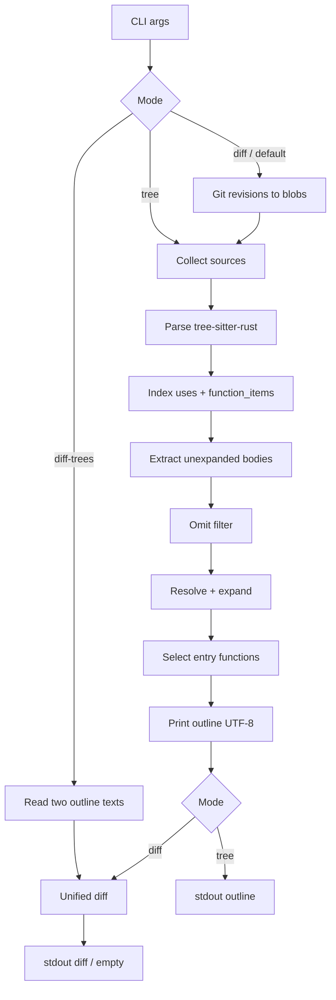
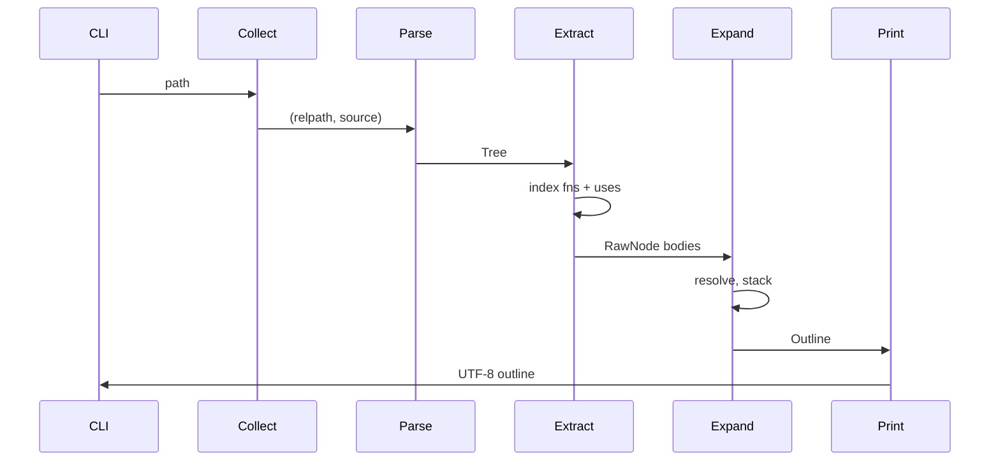

# Seer v1 Design Specification

| Field | Value |
|---|---|
| **Title** | Seer: control-and-call outlines and outline diffs |
| **Author** | Stefan Mihai Stanescu / project Seer |
| **Date** | 2026-08-17 |
| **Status** | Draft |
| **License** | MIT (existing `LICENSE` in the repo) |
| **Repo** | https://github.com/MajorScruffy/seer (local: `/home/stefan/Work/seer`) |
| **Audience** | Implementing agents and reviewers. This document is the behavior oracle. |

When this spec is committed, it lives at `docs/spec.md`. Paths below are relative to the repo root.

The repo today contains only `LICENSE` and the initial commit. There is no existing architecture to match. This spec defines a new Rust CLI.

**How to use this document.** Every implementable claim has a check. Do not invent output format, indent width, omit rules, or resolve order. If a behavior is not in this spec, it is either forbidden in v1 or listed under [Open Questions](#open-questions). Do not “improve” the outline shape.

---

## Overview

Seer prints a **sparse control-and-call outline** of source code, then diffs those outlines. It is not an AST dump, not a type-aware call graph, and not a pretty-printer. The outline shows function/method definitions, control-flow headers, and call sites. Local callees are expanded in place; external library calls appear as leaves; logging/debug APIs are omitted.

v1 is a Rust-only CLI (`seer`) built on tree-sitter. It must work on git blobs and dirty worktrees without compiling the target project. Delivery order is fixed: **tree → tree-diff → commit-diff → default dirty-vs-HEAD**.

Success is not aesthetic. Success is byte-identical stdout against the golden fixtures in [Verification](#verification), plus the listed `cargo test` commands exiting 0.

---

## Background & Motivation

Reading a diff of raw source mixes types, comments, logging, and control flow. Reviewers who want “what does this do?” need a stable, line-oriented skeleton of control flow and calls.

Constraints that drive the design:

- **Git blobs are not a crate.** Commit diffs and dirty-vs-HEAD cannot require `rustc`, rust-analyzer, or generated code.
- **Type-directed method resolve is out of scope.** v1 may under-expand; it must never guess across types.
- **The outline is also the diff input.** Format must be deterministic, indentation-only, and free of timestamps/color.

Pain of alternatives: rust-analyzer needs a working sysroot and is slow on historical commits; `syn` rejects incomplete files; box-drawing trees break line diffs.

---

## Goals & Non-Goals

### Goals

1. Parse Rust with tree-sitter and emit the outline format defined here.
2. Expand a call iff its definition is uniquely found by the v1 resolve rules in the analyzed set.
3. Omit only the logging/debug APIs in [Omit list](#omit-list-v1).
4. Diff two outlines with the unified-diff algorithm defined here.
5. Diff outlines of two git revisions; with no args, diff the worktree against `HEAD`.
6. Same input → byte-identical stdout on every run.

### Non-Goals (v1)

- JS/TS, C#, or any language other than Rust.
- rust-analyzer, rustc, cargo check, macro expansion, or cfg evaluation.
- Type-aware method resolution, trait selection, or autoderef.
- `--format`, JSON, HTML, box-drawing, color.
- `--depth`, `--ignore`, or user config (hardcoded omit list only).
- Expanding external crates (std, crates.io, etc.).
- Expanding macros into their definitions.
- Incremental/watch mode, LSP, or a library API for other tools beyond what tests need.
- Network access.

---

## Key Decisions

| Decision | Choice | Rationale |
|---|---|---|
| Parser | tree-sitter + `tree-sitter-rust` | Works on blobs and broken files; no compile. Already decided. |
| Resolve | Name + `use` paths, not rust-analyzer | Fast, deterministic, works without a project. Under-expand rather than guess. |
| First language | Rust only | Grammar mapping and omit list fully specified. JS/TS/C# are follow-on. |
| Outline shape | Indentation-only, 2 spaces, no box-drawing | Line-oriented diff input. Normative example is law. |
| External calls | Show as leaves, do not expand | Reviewers still see I/O and serde; no need for crate sources. |
| Local calls | Expand in place under the call snippet | The outline is interprocedural from entry functions. |
| Conditions | Text on the control line; not call nodes | `if items.is_empty()` stays one line; predicates are not expanded. |
| Omit | Logging/debug APIs only | A local `fn info` is kept. `clone`/`unwrap`/`to_string` are kept. |
| `std::` in print | `strip_std` on **call/macro display only**, never on control / return / match-arm text | Normative example prints `fs::write` for `std::fs::write`. `if std::fs::exists(p)` keeps `std::`. |
| Recursion | `<call-snippet> [recursive]` and stop | Prevents infinite expand; uses definition identity, not name. |
| Method expand | Exactly one `function_item` **or** `function_signature_item` with that name in the analyzed set | Do not guess across types. 0 or ≥2 matches → leaf. Signatures count toward uniqueness. |
| Free-fn expand (unqualified) | Same file, then imports, then same module, then stop | Decided collision rule. Does **not** search the whole repo by name. Locked by `cross_file_no_search`. |
| Path-qualified local modules | Last segment is the fn name; prefix must map to a module in the analyzed set | `foo::bar()` expands when `foo.rs` defines free `bar`. `crate`/`self`/`super` remap first. `Item::valid` is not a module → leaf. |
| UFCS / associated paths | Free calls, not methods. v1 leaves them | `Item::valid(item)` and `Self::new()` never use method uniqueness. |
| DAG expand | Re-expand a callee at every call site | The outline is the interprocedural view. Pathological diamonds are unbounded. Locked by `diamond`. |
| File tree roots | Entry functions only (see [Entry functions](#entry-functions)) | The normative file contains `process` and `handle` but prints only `fn process`. |
| Diff | Unified diff, 3 lines of context, no timestamps | Standard, testable, pipeable. Exit 0/1 like `diff`. |
| Exit codes | `0` ok / no diff, `1` diffs, `2` usage, `3` runtime | Separates “no changes” from errors. |
| Default argv | `seer` with no args ≡ `seer diff` (WORKTREE vs HEAD) | Product op 4. |
| Stdin | `seer -` and `seer tree -` read stdin as `<stdin>` | Path `-` is never a filesystem path. |
| Git access | `git` CLI (`ls-tree`, `show`, `rev-parse --show-toplevel`) | No libgit2. Collect from worktree root, not cwd. |
| Cargo.toml | **Not read in v1** | All goldens and git cases are sourceless of cargo. Dep/package-name resolve is Open Question 4. |
| Crate layout | Single package `seer` at repo root | Greenfield small CLI; workspace split is premature. |
| Color | Never in v1, including clap help | `ColorChoice::Never`. Tests forbid ESC in `--help`. |
| Multi-file headers | No `file path` lines in v1 | The normative format has none. Roots sorted by `(path, start_byte)`. |

---

## Proposed Design

### High-level pipeline



**Check:** A call that is omitted never appears in the printed outline. A local callee that resolves uniquely appears and, if not already on the expand stack, has its body as children.

### Crate layout

Single Cargo package at the repo root (do not create a workspace):

```
.gitignore
LICENSE                 # already present; do not rewrite
Cargo.toml
Cargo.lock              # commit it
rustfmt.toml
src/main.rs             # argv → seer::run → stdout/stderr/exit
src/lib.rs              # public: run, outline_files, diff_text
src/cli.rs              # clap
src/error.rs            # SeerError + exit codes
src/collect.rs          # file walk, stdin, exclusions
src/parse.rs            # tree-sitter parse → Tree
src/ir.rs               # Outline / RawNode / FnDef / FnId
src/extract.rs          # CST → unexpanded RawNode per function
src/omit.rs             # omit list matching
src/resolve.rs          # name + use resolve
src/expand.rs           # interprocedural expand + recursion mark
src/entry.rs            # entry-function selection
src/print.rs            # Outline → String
src/collapse.rs         # whitespace collapse outside literals
src/diff.rs             # unified diff
src/git.rs              # git CLI wrapper
src/lang/mod.rs
src/lang/rust.rs        # node-kind table + header reconstruction
tests/fixtures.rs       # golden tree + diff
tests/cli.rs            # binary argv / exit codes
tests/git.rs            # temp-repo commit and dirty tests
tests/common/mod.rs     # read fixture dir, assert_bytes
tests/fixtures/tree/<name>/...
tests/fixtures/diff/<name>/...
```

`Cargo.toml` (normative fields):

```toml
[package]
name = "seer"
version = "0.1.0"
edition = "2021"
rust-version = "1.80"
license = "MIT"
description = "Control-and-call outlines of source code"
repository = "https://github.com/MajorScruffy/seer"

[dependencies]
clap = { version = "4", features = ["derive"] }
tree-sitter = "0.25"       # 0.25.x as of 2026-08; 0.25.10 known good with rust 0.24.2
tree-sitter-rust = "0.24"  # 0.24.x as of 2026-08; 0.24.2 known good

[dev-dependencies]
tempfile = "3"
```

Do **not** add a `toml` crate in v1 (Cargo.toml of the *target* project is not parsed; see [Module identity](#module-identity)). Pin the 0.25 / 0.24 pair as of 2026-08. If that pair does not link on a newer crates.io, pin the newest 0.25.x + 0.24.x that do. **Behavior is locked by fixtures, not by crate minor.** After the first build that parses Rust, run the tree fixtures before changing grammar-mapping code.

`rustfmt.toml`:

```toml
edition = "2021"
```

`.gitignore`:

```
/target
**/*.actual
```

**Check:** `cargo build` produces `target/debug/seer`. `cargo test` is valid from the repo root.

### Analyzed set

| Invocation | Analyzed set |
|---|---|
| `seer tree FILE.rs` or `seer FILE.rs` | That file only |
| `seer tree DIR` or `seer DIR` | All collected `.rs` files under `DIR` |
| `seer -`, `seer tree -`, or `seer tree` with stdin piped | One virtual file named `<stdin>` |
| `seer diff` / `seer` (git modes) | Per side: all collected `.rs` files in that revision or worktree |

**Collect rules** (`src/collect.rs`):

- Include regular files whose name ends with `.rs` (case-sensitive).
- Exclude a file if any path component is `target`, `.git`, or `node_modules`.
- Exclude a file if any path component starts with `.` (dot dirs/files).
- Follow only directories that pass the same component filters. Do not follow symlinks (`std::fs::read_dir` entries where `file_type()?.is_symlink()` → skip).
- Sort included paths by relative POSIX path (`/` separators, no `./` prefix) using UTF-8 byte order (`str` comparison).
- **Relative root / `FnId.file` (normative, pick is law):**
  - `outline_files`: the path string passed in each pair. The golden harness uses `input.rs` or paths relative to `input/` (`a.rs`, `lib.rs`, …).
  - CLI single file: the path **as given on argv**, with only `\` → `/` on Windows. Not canonicalized, not made absolute, not reduced to a basename. `seer tests/fixtures/tree/empty_file/input.rs` → `FnId.file = "tests/fixtures/tree/empty_file/input.rs"`.
  - CLI directory: POSIX path relative to the directory argument.
  - stdin (`-`): `<stdin>`.
  - Git: path as `git ls-tree -r --name-only` prints (relative to the worktree root).

**Check:** A fixture directory `tests/fixtures/tree/name_collision/input/{a.rs,b.rs}` is collected as `a.rs` then `b.rs`. A `target/` subtree is never read. `cargo test --test cli` `cli_tree_directory` outlines that directory and matches `name_collision/expected.txt`.

### Parse

- Encoding: source must be valid UTF-8. Invalid UTF-8 → `SeerError::Io` / exit 3, stderr `error: invalid utf-8: <path>`.
- Parser: `tree_sitter_rust::LANGUAGE` (or the equivalent `language()` API of the pinned crate).
- Tree-sitter is error-tolerant. **Do not fail the process** because the CST contains `ERROR` nodes. Skip `ERROR` nodes and continue.
- Do not run rustc. Do not expand macros. Do not evaluate `#[cfg]`. Every `function_item` is visible.

**Check:** `tests/fixtures/tree/empty_file` and a file of only types produce empty stdout and exit 0.

### Outline IR

```rust
/// Identity of a `function_item` in the analyzed set.
#[derive(Clone, Debug, PartialEq, Eq, Hash)]
pub struct FnId {
    /// POSIX relative path, or `<stdin>`.
    pub file: String,
    pub start_byte: usize,
}

#[derive(Clone, Copy, Debug, PartialEq, Eq)]
pub enum FnKind {
    Free,
    Method,
}

#[derive(Clone, Debug)]
pub struct Outline {
    pub roots: Vec<OutlineNode>,
}

#[derive(Clone, Debug)]
pub struct OutlineNode {
    pub text: String,
    pub children: Vec<OutlineNode>,
}
```

There is one printed form for every node: `text` at its indent. Function roots use `fn {name}`. Control and calls use the reconstructed / collapsed snippet. Recursion appends ` [recursive]` to the call text (one space before `[`).

Unexpanded extraction uses a parallel `RawNode` that carries resolve keys (not printed):

```rust
pub enum RawNode {
    Control { text: String, children: Vec<RawNode> },
    NestedFn { name: String, children: Vec<RawNode> },
    Call { site: CallSite },
}

pub struct CallSite {
    pub display: String,     // already collapsed + std-prefix-stripped
    pub kind: CallKind,
    pub is_macro: bool,
    /// Same string as `FnId.file` of the source that contains this call.
    /// Required: same-file / same-module / use-map resolve read this, not a side channel.
    pub file: String,
}

pub enum CallKind {
    /// `foo()`, `foo::bar()`, `crate::foo()`, `todo!()`
    Free { path: Vec<String> },
    /// `recv.method(...)`  — `path` unused; name is last segment
    Method { name: String },
}
```

For `Free { path }`, `path` is the callee path segments in source (or after splitting a `scoped_identifier`), e.g. `["handle"]`, `["serde_json", "to_string"]`, `["std", "fs", "write"]`, `["crate", "other", "handle"]`. Macro names do not include `!` in `path`’s last segment; `is_macro = true` instead.

**Check:** Unit tests construct an `Outline` and assert `print.rs` output byte-for-byte (see [Printer](#printer)).

### Classification of `function_item`

Walk ancestors of the `function_item`:

- If the nearest of `{impl_item, trait_item, source_file, mod_item}` is `impl_item` or `trait_item` → `FnKind::Method`.
- Otherwise → `FnKind::Free` (includes nested functions inside another `function_item`, and functions in inline `mod_item`).

`function_signature_item` (trait methods without a body) is **indexed for name collision** (it counts as a `function_item`-like name for method uniqueness) but is **not an expand target** and is **not an entry** (no body to print).

**Check:** `method_single` expands; `method_many` and `method_sig_collision` do not.

### Extraction (single function body)

Only these CST nodes produce outline nodes. Everything else is walked through or ignored as specified in the table.

Home of this table: **this section**. Other sections reference it; they do not repeat it.

| tree-sitter kind | Action |
|---|---|
| `function_item` (the one being extracted) | Do not emit another `fn` line for itself. Walk `body`. |
| `function_item` (nested inside the body) | Emit `fn {name}` (`name` field). Walk its `body` as children. Also index it as a definition. |
| `if_expression` | See [If / else-if / else](#if--else-if--else). |
| `for_expression` | Emit one control node. Header: [Headers](#header-reconstruction). Walk `body` only. **Do not** walk `pattern` or `value` for calls. |
| `while_expression` | Emit one control node. Walk `body` only. **Do not** walk the condition. |
| `loop_expression` | Emit one control node. Walk `body` only. |
| `match_expression` | Emit `match {scrutinee}`. Walk each `match_arm` in source order. **Do not** walk `value` (scrutinee) for calls. |
| `match_arm` | Emit a child of the match whose text is the collapsed `pattern` field (`match_pattern`, includes `if` guard). Walk the arm `value` (block or expr). **Do not** walk the guard for calls. Skip `attribute_item` children. |
| `return_expression` | Emit collapsed full node (`return` or `return {expr}`). **Do not** walk the value for call nodes. |
| `break_expression` | Emit collapsed full node. **Do not** walk the value. |
| `continue_expression` | Emit collapsed full node. |
| `try_block` | Emit `try`. Walk the inner `block`. |
| `call_expression` | If not omitted: emit one call node. **Do not** walk `function` or `arguments` for additional call/control nodes. |
| `macro_invocation` | If not omitted: emit one call node. **Do not** walk `token_tree` for calls. |
| `let_declaration` | Emit nothing. Walk `value` (if any) with the full walker. Walk `alternative` (let-else block) with the full walker. No `let` line. |
| `expression_statement` | Walk the inner expression. |
| `block`, `unsafe_block`, `async_block`, `const_block`, `gen_block` | Walk named children in source order. No extra line. |
| `closure_expression` | Walk `body`. No closure line. |
| `assignment_expression`, `compound_assignment_expr` | Walk `right` only (lhs is not a call home we care about). |
| `parenthesized_expression`, `reference_expression`, `unary_expression`, `type_cast_expression`, `await_expression`, `try_expression` (`?`), `index_expression`, `field_expression`, `range_expression`, `binary_expression` | Walk named children. No extra line. (`?` and `.await` are not outline nodes.) |
| `struct_item`, `enum_item`, `type_item`, `const_item`, `static_item`, `trait_item`, `impl_item`, `use_declaration`, `mod_item` (the declaration), `attribute_item`, `inner_attribute_item`, `type_parameters`, comments | Ignore as outline nodes. Still recurse into `impl_item` / `trait_item` / `mod_item` **bodies** when **indexing** definitions, not when walking a function body for calls (except nested `function_item` as above). |
| `ERROR` | Skip. |
| Any other kind | Walk named children. Do not emit a node. |

**Call-in-statement vs call-in-header.** A `call_expression` inside an `if`/`while` condition, `for` header, `match` scrutinee, match-arm guard, or inside another call’s callee/arguments is **not** visited by the walker (those subtrees are not walked). A `call_expression` that is a `let` value, an expression statement, an if/loop/match **body**, an assignment RHS, or a closure body **is** visited.

**Check:** `tests/fixtures/tree/call_in_let` prints the `let` RHS call. `tests/fixtures/tree/process_handle` does **not** print `items.is_empty()`, `item.valid()`, or `item.ready()` as their own nodes. `tests/fixtures/tree/headers_keep_std_and_skip_calls` does **not** print `items.iter()` or `compute()` as call nodes.

#### If / else-if / else

An `if_expression` produces a **flat sibling chain**, not a nested `else` → `if`.

```text
if <cond>
  <consequence outline>
else if <cond>
  <consequence outline>
else
  <else-block outline>
```

Algorithm (normative):

```
fn extract_if(node) -> Vec<RawNode>:
    out = []
    keyword = "if"
    current = node
    loop:
        cond_text = collapse_node(condition, source)
        text = keyword + " " + cond_text
        children = walk(consequence block)
        out.push(Control { text, children })
        alt = current.child_by_field_name("alternative")  # else_clause or none
        if alt is None: break
        child = first named child of else_clause
        if child.kind == "if_expression":
            keyword = "else if"
            current = child
            continue
        else:  # block
            out.push(Control { text: "else", children: walk(child) })
            break
    return out
```

When the walker sees an `if_expression`, it **extends** the current sibling list with `extract_if(...)` (it does not wrap the chain in an extra parent).

**Check:** `tests/fixtures/tree/if_else_if_else` matches exactly.

#### Header reconstruction

Do **not** take a raw slice that includes `{`. Build the line as follows. `collapse` is [Whitespace collapse](#whitespace-collapse).

| Construct | Printed text |
|---|---|
| `if` | `if ` + `collapse(condition)` |
| `else if` | `else if ` + `collapse(condition)` |
| `else` | `else` |
| `for` | `label_prefix` + `for ` + `collapse(pattern)` + ` in ` + `collapse(value)` |
| `while` | `label_prefix` + `while ` + `collapse(condition)` |
| `loop` | `label_prefix` + `loop` |
| `match` | `match ` + `collapse(value)` |
| match arm | `collapse(pattern field)` |
| `return` / `break` / `continue` | `collapse(entire node)` — **not** `strip_std`. Bare `return;` → `return`. `return true;` → `return true`. |
| `try` | `try` |
| `function_item` | `fn ` + name identifier (not `async`/`const`/`unsafe`/`pub`/generics/params) |
| call / macro | `strip_std(collapse(entire node))` — **only** this row uses `strip_std` |

`label_prefix`: if the loop node has a `label` child, `collapse(label)` + `: ` (example: `'outer: loop`). `label` source includes the leading `'`.

**Check:** Loop fixture headers are `loop`, `while true`, `for item in items`. `method_single` prints `return true`. `headers_keep_std_and_skip_calls` prints `if std::fs::exists(p)` (prefix kept).

### Whitespace collapse

Home of this rule: **this section**.

Normative signatures (production code uses these; do not invent a pure `collapse(&str)` that guesses literals):

```rust
/// `literal_ranges` are half-open byte offsets into `src` that must be copied verbatim.
pub fn collapse(src: &str, literal_ranges: &[(usize, usize)]) -> String;

/// Collect ranges of descendant nodes whose kind is exactly one of
/// `string_literal`, `raw_string_literal`, `char_literal` (tree-sitter-rust 0.24;
/// byte/C-string literals are **not** separate kinds in this grammar), then
/// `collapse(node.utf8_text(src), ranges_relative_to_that_slice)`.
pub fn collapse_node(node: tree_sitter::Node, src: &str) -> String;
```

Algorithm of `collapse(src, literal_ranges)`:

```
Walk src by Unicode scalar values.
Inside a listed literal range: copy bytes unchanged.
Outside those ranges: each maximal run of `ch.is_whitespace()` becomes a single ASCII space ` `.
Then trim leading/trailing ASCII spaces from the result (do not trim inside).
```

If a header is built from several pieces, `collapse_node` each piece, then concatenate as specified (do not re-collapse the concatenation in a way that would delete the required single spaces around `in`).

`strip_std(s)`: if `s` starts with `::`, drop that prefix. Then if `s` starts with `std::`, `core::`, or `alloc::`, drop that one prefix. Apply once. (`std::fs::write(path, data)` → `fs::write(path, data)`.) **Never** call `strip_std` on control, return, break, continue, match-arm, or `fn` lines.

Calls do not include a trailing `;` (the semicolon is on `expression_statement`, not on `call_expression`).

**Check:** The process/handle fixture prints `fs::write(path, data)` not `std::fs::write(path, data)` and not `fs::write(path, data);`.

### Omit list (v1)

Home of the omit list: **this table**. Do not fork copies. v1 implements **Rust only**. JS/TS and C# names live only under [Follow-on languages](#follow-on-languages-non-blocking-sketch); do not encode them in v1.

| Language | Drop these |
|---|---|
| Rust | `println!` `eprintln!` `print!` `eprint!` `dbg!` · `log::*` · `tracing::*` |

#### Rust matching algorithm

Inputs: the `CallSite` plus the resolve result (local `FnId` or not).

1. If resolve found a **local** expand target (`FnDef` in the analyzed set) → **never omit**. A local `fn info` or local `fn warn` is kept.
2. Else if `is_macro` and the last path segment is one of `{println, eprintln, print, eprint, dbg}` → omit.
3. Else if the **canonical path**’s first segment is `log` or `tracing` → omit.
4. Else keep.

**Canonical path** for step 3:

- Start with `CallSite.kind` path segments as written.
- If the first segment is an identifier imported by `use` in the current file, prepend/replace using that import’s path (see [Use map](#use-map)).
  - `use log::warn;` + `warn!("x")` → `["log", "warn"]`.
  - `use log;` + `log::warn!("x")` → `["log", "warn"]`.
  - `use tracing::info as tinfo;` + `tinfo!("x")` → `["tracing", "info"]`.
- `log::warn("empty")` (function-call form, no `!`) is still `["log", "warn"]` and is omitted.

Do **not** omit `clone`, `unwrap`, `to_string`, `drop`, `format!`, `vec!`, `todo!`, `assert!`, `assert_eq!`, `debug_assert!`, `panic!`, `unimplemented!`, `unreachable!`.

**Check:** `tests/fixtures/tree/omit_logging` and `tests/fixtures/tree/macros_stay`.

### Use map

From each file’s top-level and inline-module `use_declaration` nodes, build a list of bindings visible in that file (v1 is file-scoped: all `use`s in the file apply to all functions in the file; do not implement hygiene or block-scoped `use`).

Supported forms (tree-sitter `use_declaration` / `use_list` / `use_as_clause` / `use_wildcard`):

| Source | Bindings |
|---|---|
| `use foo::bar;` | `bar` → `["foo","bar"]` |
| `use foo::bar as baz;` | `baz` → `["foo","bar"]` |
| `use foo::{bar, baz};` | `bar` → `["foo","bar"]`, `baz` → `["foo","baz"]` |
| `use foo::*;` | glob: prefix `["foo"]` |
| `use foo;` | `foo` → `["foo"]` |
| `use crate::other::handle;` | `handle` → `["crate","other","handle"]` |
| `use crate::other::*;` | glob: prefix `["crate","other"]` |

Nested groups (`use foo::{bar::{baz, qux}}`) must be flattened. `self` in a group (`use foo::{self, bar}`) binds `foo` → `["foo"]`.

**Check:** `tests/fixtures/tree/omit_logging` uses `log::warn!` without a `use`. `tests/fixtures/tree/use_expand` expands `use crate::other::handle; handle();`. `omit::use_log_warn_macro` (lib) covers `use log::warn` + `warn!` omit.

### Module identity

Used only for “same module” resolve and for `crate`/`self`/`super` / sibling-module paths.

**v1 does not read any `Cargo.toml`.** There is no package name and no dependency list. `outline_files` stays a pure `(path, rust_source)` function.

**Module root** = the collect root (directory argument, git worktree toplevel, or the virtual root of an `outline_files` batch).

**`rel` is per-path:** if *this* collected path starts with `src/`, drop that one prefix (`src/main.rs` → `main.rs`); otherwise `rel` is the path as collected (`root.rs` → `root.rs`). Do **not** apply a global “any file is under `src/`” switch to paths outside `src/`. Mixed trees (`root.rs` + `src/main.rs`) are therefore `["root"]` and `[]`. `outline_files` uses the path strings as already relative to the module root (fixture `input/lib.rs` → `rel = lib.rs`; no implicit `src/` unless the string itself starts with `src/`).

**File → module path** (`Vec<String>`, crate root is `[]`):

- If the filename is `lib.rs`, `main.rs`, or `mod.rs` → module path = parent directory components of `rel`.
- Else strip `.rs` → module path = those components (e.g. `foo/bar.rs` → `["foo","bar"]`).
- `<stdin>` → `[]`.

Examples: `lib.rs` → `[]`; `main.rs` → `[]`; `foo.rs` → `["foo"]`; `foo/mod.rs` → `["foo"]`; `foo/bar.rs` → `["foo","bar"]`; git `src/lib.rs` → `[]`; git `src/foo.rs` → `["foo"]`; git `root.rs` next to `src/main.rs` → `["root"]` (not `../root`).

Two files are the **same module** iff their module paths are equal.

`super` pops one segment (crate root’s `super` fails resolve → leaf). `self` is the current module. `crate` is `[]`.

A module **exists** in the analyzed set iff at least one collected file maps to that module path.

### External paths

A free-call path is **external** (leaf, no expand) if any of these hold:

1. First segment is `std`, `core`, `alloc`, `proc_macro`, or `test`.
2. *(empty in v1 — no Cargo.toml dependency list. Hyphenated crate names, `[dependencies]`, and workspace members are [Open Question 4](#open-questions).)*
3. After remapping a leading `crate` / `self` / `super` (see Resolve A), the remaining prefix does **not** name a module that exists in the analyzed set.

Consequently `serde_json::to_string` is external (no module `["serde_json"]`). `foo::bar` is **not** external when `foo.rs` or `foo/mod.rs` is in the set. `Item::valid` is external unless a module path `["Item"]` exists.

`crate::…`, `self::…`, and `super::…` are local prefixes (not external by rule 1). There is no `package_name::` local prefix in v1.

**Check:** process/handle shows `serde_json::to_string(item)` as a leaf. `local_mod_path` expands `foo::bar()`. `ufcs_leaf` leaves `Item::valid(item)`.

### Resolve

Home of resolve order: **this section**.

Resolve is attempted only to decide expand vs leaf (and omit step 1). Display text is always the call snippet, never the resolved `fn` line.

#### Free / path-qualified calls (`CallKind::Free`)

Let `path` be the segment list. **The last segment is always the function name** (`name = path.last()`). Let `cur` be `site.file` (the call site’s file). `resolve(site)` **must** use `site.file`; there is no other file context.

**A. Path-qualified (`path.len() >= 2`):**

1. If `path[0]` is `std`, `core`, `alloc`, `proc_macro`, or `test` → leaf.
2. Compute `prefix = path[0..len-1]` and map it to a module path `mod_path`. **Exactly one** of the following cases applies, in this order. Do **not** fall through after a case matches (in particular, after stripping `super` do not re-enter the `crate` / `self` / else arms — `prefix` may now be empty).
   - **Leading `super`:** if `prefix[0] == "super"`: let `mod_acc = cur`’s module. While `prefix` starts with `super`: if `mod_acc` is `[]` → leaf; else pop one segment from `mod_acc` and strip that `super` from `prefix`. Then `mod_path = mod_acc + remaining prefix` (remaining may be empty). Example: from module `["foo"]`, `super::bar` → `mod_path = []`, `name = bar`.
   - **`crate`:** else if `prefix[0] == "crate"`: `mod_path = prefix[1..]`.
   - **`self`:** else if `prefix[0] == "self"`: `mod_path = cur_module + prefix[1..]`.
   - **Else:** `mod_path = prefix` as written (sibling / absolute from crate root). Example: `foo::bar` → `mod_path = ["foo"]`, `name = bar`. `foo::bar::baz` → `mod_path = ["foo","bar"]`, `name = baz`.
3. If `mod_path` is **not** a module that exists in the analyzed set → leaf. Do not treat type names as modules. Do not search by function name across modules.
4. Free `function_item`s whose module is `mod_path` and whose name is `name`. If exactly 1 → that expand target. Else (0 or ≥2) → leaf. Do not pick a method.

**B. Unqualified (`path == [name]`), including macros that were not omitted:**

1. **Same file.** Free `function_item`s in `cur` whose name is `name`. If exactly 1 → that target. If ≥2 → leaf (stop). If 0 → continue.
2. **Imports.**
   - If `name` is a non-glob binding: interpret the bound path as in A (including `crate`/`self`/`super` and sibling modules). If that yields exactly one local free function → that target. If the bound path is external → leaf. If the bound path is local but 0 or ≥2 defs → leaf.
   - Else, consider every glob whose prefix maps to an existing module: free functions named `name` in those modules. If the union has size 1 → that target. If ≥2 → leaf. If 0 → continue.
3. **Same module.** Free `function_item`s in **other files** of the same module as `cur`, name `name`. If exactly 1 → that target. Else (0 or ≥2) → **stop**. Do **not** search the rest of the repo by name.

Unqualified `handle()` defined only in a *different* module is therefore a leaf. That failure direction is `tests/fixtures/tree/cross_file_no_search`. An implementation that “unique name anywhere” expands will fail that golden.

Macros: v1 **never expands** a `macro_invocation` into a `macro_definition` body. After omit, a kept macro is always a leaf. Steps above still run only to decide omit-vs-local (a local `fn todo` does not capture `todo!`; macros do not resolve to `function_item`s).

#### Method calls (`CallKind::Method`)

A call is a method iff the `call_expression`’s `function` field is a `field_expression` (e.g. `item.valid`, `item.valid()`), or a `generic_function` whose `function` is a `field_expression` (`item.valid::<T>()`).

Expand iff the analyzed set contains **exactly one** `function_item` **or** `function_signature_item` whose name equals the method name.

- 1 match and it is a `function_item` with a body → expand target.
- 1 match but it is a signature only → leaf.
- 0 or ≥2 → leaf.

Do not use types. Do not prefer impl of the receiver. Do not use `use`.

UFCS `Type::method(recv)` and `Self::name(...)` are **not** method calls; they are path-qualified free calls (algorithm A). They do **not** consult method uniqueness. Typically `Type` / `Self` is not a module → leaf.

**Check:** `name_collision`, `cross_file_no_search`, `local_mod_path`, `use_expand`, `super_self_path`, `method_single`, `method_zero`, `method_many`, `method_sig_collision`, `ufcs_leaf`.

### Expand

```
expand_fn(def, stack) -> Vec<OutlineNode>:
    if def.id in stack:
        # caller handles this; see expand_call
        unreachable
    push def.id onto stack
    nodes = map each RawNode in def.body through expand_raw(_, stack)
    pop
    return nodes

expand_raw(raw, stack) -> Vec<OutlineNode> | OutlineNode:
    Control/NestedFn: copy text; children = flatten expand_raw of children
    Call:
        text = site.display
        target = resolve(site)   # uses site.file
        if no target: return node(text, [])
        if target.id in stack: return node(text + " [recursive]", [])
        return node(text, expand_fn(target, stack))
```

The stack is keyed by `FnId` (file + start_byte), not by name. It is a **path** stack, not a global “already expanded” set.

When printing an **entry** function, push that function’s id before expanding its body so a self-call is marked `[recursive]`.

**Re-expand (normative):** the same callee called twice sequentially is expanded twice (the first expand pops before the second). A diamond `a→b, a→c, b→d, c→d` prints `d`’s body in full under both `b()` and `c()`. v1 does **not** mark-once. Pathological DAGs can make the outline much larger than the source; there is no size cap. That is accepted.

**Check:** `tests/fixtures/tree/recursive`. `tests/fixtures/tree/diamond` reprints `d` twice. `call_in_let` expands `compute` twice.

### Entry functions

After indexing and resolve, a definition `F` is an **entry** iff:

1. `F` is a `function_item` with a body (not a signature), AND
2. No call site in the analyzed set resolves to `F` as its expand target.

Print entries only, as roots, in order of `(file path, start_byte)` (byte order of path strings, then `start_byte` ascending). Do **not** sort by `FnKind`. `method_many` locks this: both `fn valid` items precede `fn process` in the file.

**Cycle fallback:** if the analyzed set has at least one **non-nested** `function_item` with a body and the entry set is empty (pure cycle), treat **every** non-nested body-bearing `function_item` as an entry. Each will show `[recursive]` on back-edges. Locked by `cycle_fallback`.

**v1 rule:** nested functions (`function_item` whose ancestor is another `function_item`) are **never entries**. They appear only as `fn {name}` children of the enclosing function’s body (extract table), and *also* via expand under a call if they resolve. Double-print when a nested fn is defined and called is required. Locked by `nested_fn`.

**Check:** process/handle prints only `fn process`. `two_entries` prints both roots. `recursive` prints `fn walk` once. `cycle_fallback` prints both cycle members. `nested_fn` never lifts `inner`/`unused` to column 0. `method_many` root order is start-byte order.

### Printer

- Indent: two ASCII spaces per depth. No tabs. No box-drawing (`│├└─` forbidden).
- Line: `indent + node.text` with **no trailing whitespace**.
- Each printed line ends with `\n` (LF only, including on Windows).
- Between two **roots**, emit one extra `\n` (one blank line).
- After the last line of the last root, stop (exactly one `\n` at EOF, no trailing blank line).
- Empty outline (`roots` empty): empty string, **zero bytes**.
- Encoding: UTF-8, no BOM.
- No color, no timestamps, no file-path headers, no line numbers.

```
print(outline) -> String:
    if outline.roots is empty: return ""
    parts = []
    for i, root in enumerate(outline.roots):
        if i > 0: parts.push("\n")
        emit(root, depth=0, parts)
    return join(parts)

emit(node, depth, parts):
    parts.push(" " * (2 * depth) + node.text + "\n")
    for child in node.children:
        emit(child, depth+1, parts)
```

**Check:** Every tree fixture’s `expected.txt` is compared as raw bytes to this printer’s output.

### Sequence: tree of a file



---

## CLI / Interface Changes

This is a new binary. There is no previous CLI.

### Argv (normative)

```
seer [--help] [--version]
seer <PATH>
seer tree [PATH]
seer diff [REV] [REV]
seer diff-trees <A> <B>
```

**Parse strategy (normative).** Do **not** use an optional `#[command(subcommand)]` plus a sibling positional `path` — clap 4 will treat `seer tests/foo.rs` as an unrecognized subcommand (exit 2) and fail `cli_tree_bare_path`.

First-token dispatch in `run` / `cli.rs` (after `argv[0]`):

```
let rest = &args[1..];
match rest.first().map(|s| s.as_str()) {
    Some("-h" | "--help")    => clap help for the root command, exit 0
    Some("-V" | "--version") => clap version, exit 0
    Some("tree")       => parse remaining with TreeArgs (path optional)
    Some("diff")       => parse remaining with DiffArgs (0..=2 revs)
    Some("diff-trees") => parse remaining with DiffTreesArgs (two paths)
    Some(_)            => tree mode; path = rest[0]; extra tokens → exit 2
    None               => git WORKTREE vs HEAD
}
```

`seer -` therefore hits `Some("-")` and is tree-of-stdin (`FnId.file = "<stdin>"`), not a flag.

Clap may still derive **per-subcommand** structs. The following root derive is **non-normative** (documentation only); if used, it must not be the sole parser for `seer <PATH>`:

```rust
#[derive(Parser)]
#[command(
    name = "seer",
    version,
    about = "Control-and-call outlines of source code",
    color = clap::ColorChoice::Never, // required; never color help/version
)]
struct TreeArgs { /* used only after first token is `tree` */ }
```

Dispatch (behavior table):

| Args | Mode |
|---|---|
| `seer` (no args) | Git: WORKTREE vs `HEAD` |
| `seer <PATH>` where PATH is not a reserved token | Tree of PATH |
| `seer -` | Tree of stdin, path `<stdin>` (even if tty) |
| `seer tree` | Tree of stdin if stdin is **not** a tty; else exit 2 |
| `seer tree -` | Tree of stdin (even if tty) |
| `seer tree PATH` | Tree of PATH |
| `seer diff` | Git: WORKTREE vs `HEAD` |
| `seer diff REV` | Git: WORKTREE vs `REV` (like `git diff REV`) |
| `seer diff REV1 REV2` | Git: outline(`REV1`) vs outline(`REV2`) (old → new) |
| `seer diff-trees A B` | Diff file `A` vs file `B` as outline **text** (do not re-parse as Rust) |
| `seer --help` / `seer --version` | clap default, exit 0 |
| `seer diff a b c` | exit 2 (too many revs) |

Subcommand names win over paths: `seer diff` is never “tree the file named `diff`”. Use `seer ./diff` to outline a file named `diff`.

v1 flags: **none** besides clap’s `--help` / `--version`. Do not add `--format`, `--depth`, `--color`, or `--ignore`.

### PATH behavior

- Existing `.rs` file: analyzed set = that file. Language = Rust.
- Existing non-`.rs` file: exit 3, `error: unsupported language: <ext or "unknown"> (v1 supports rust only)`.
- Existing directory: collect `.rs` as specified. Non-`.rs` children are skipped silently. If zero files collected: empty outline, exit 0.
- Missing path: exit 3, `error: path not found: <path>`.
- `-`: stdin, language Rust, path `<stdin>`.

### Git behavior

Working directory must be inside a worktree. Normative commands (each `Command::new("git").args([...])`, no shell):

```
git rev-parse --is-inside-work-tree   # must print true
git rev-parse --show-toplevel         # worktree root; trim trailing slashes/newlines
```

If the first command fails or does not print `true` → exit 3, `error: not a git repository`. Collect WORKTREE files from **`--show-toplevel`**, never from `cwd`. Running `seer` in `repo/src/` must outline the same set as from `repo/`.

Revisions must satisfy `git rev-parse --verify --end-of-options <rev>^{commit}` (or `^{tree}`). Failure → exit 3, `error: invalid revision: <rev>` plus git’s stderr if useful.

**Files per side:**

- Revision side: `git ls-tree -r --name-only <rev>` filtered to collected `.rs` paths (same exclusion rules on each path component). Content: `git show <rev>:<path>` (bytes → UTF-8).
- WORKTREE side: collect `.rs` from `--show-toplevel` on disk, **including untracked** files that pass collect rules. Content: working-tree bytes (includes unstaged edits). A file present in HEAD but deleted on disk is absent from WORKTREE (empty contribution).
- Union of paths is not required as a separate pass: each side is outlined independently from its own analyzed set. Expansion on each side uses only that side’s files.
- Do **not** read `Cargo.toml` from either side (v1).

**Check:** `tests/git.rs` cases in [Git fixtures](#git-fixtures), including `git_from_subdir`.

### Exit codes

| Code | Meaning |
|---:|---|
| 0 | Success. Tree printed (including empty). Help/version. Diff with **no** changes (stdout empty). |
| 1 | Diff mode (including default `seer`) and the outlines differ. Stdout is the diff. **Not** an error. |
| 2 | Usage error (clap, `seer tree` on a tty with no path, too many revs). |
| 3 | Runtime failure: IO, invalid UTF-8, path not found, unsupported language, not a git repo, invalid rev, git command failed. |

`main` prints `error: …` to **stderr** for codes 2–3 (clap owns usage text for its own errors). **Stdout is only** the outline or the diff (or help/version).

**Check:** `tests/cli.rs` asserts these codes. Diff-no-change → 0 and empty stdout. Diff-change → 1 and fixture bytes.

### Determinism

- Same input bytes + same analyzed set → identical stdout bytes.
- LF newlines only.
- No ANSI, no timestamps, no locale-dependent numbers or dates.
- Ignore `NO_COLOR` / `TERM` (never color). Set `#[command(color = clap::ColorChoice::Never)]` (or equivalent) on every clap `Command` so `--help` / `--version` emit no ESC even on a TTY.
- Do not print progress.

**Check:** Running any tree fixture twice and hashing stdout yields one hash. `cli_help_no_ansi` asserts `--help` stdout contains no `0x1b` byte.

---

## API / Library surface

`src/main.rs` is a thin wrapper. Tests and the binary share:

```rust
pub fn run(args: &[String]) -> Result<RunOutput, SeerError> {
    run_with(args, std::io::stdin().is_terminal())
}

/// `stdin_is_terminal` is injected so `cli_tree_no_path_tty` does not need a pty.
pub fn run_with(args: &[String], stdin_is_terminal: bool) -> Result<RunOutput, SeerError> { /* first-token dispatch */ }

pub struct RunOutput {
    pub stdout: String,
    pub exit: i32, // 0 or 1
}

/// `files` is (posix_relpath, rust_source_utf8). Sorted here if needed.
/// Does **not** read the disk and does **not** take Cargo.toml bytes (v1).
pub fn outline_files(files: &[(String, String)]) -> String { /* empty → "" */ }

/// Unified diff. Empty string iff `a == b`.
pub fn diff_text(a: &str, b: &str, name_a: &str, name_b: &str) -> String {}
```

`run`’s `args` includes `argv[0]`. `outline_files` does **not** read the disk; fixture tests call it directly.

**Check:** `tests/fixtures.rs` calls `outline_files` / `diff_text` and does not require a built binary. `tests/cli.rs` uses `CARGO_BIN_EXE_seer`.

---

## Data Model Changes

No database. In-memory only.

`Cargo.toml` / `Cargo.lock` are the only persistent project files besides sources and fixtures.

No migrations.

Approximate resource envelope (**informal only — not test gates**). DAG re-expand can make the outline much larger than the source; those rows are wishful for pathological graphs.

| Workload | Informal target |
|---|---|
| Single 1k-line file tree, shallow call graph | < 100 ms after process startup |
| 50k-line crate with a non-diamond-heavy graph | a few seconds, single thread |
| Peak memory | CST + extracted IR; do not keep all CSTs after extract if avoidable |

v1 may keep CSTs until extract finishes per file, then drop them. There is **no** outline-size cap.

---

## Diff algorithm

Home of the diff format: **this section**.

`diff_text(a, b, name_a, name_b)`:

1. If `a == b` (byte-equal) → return `""` and treat as unchanged (exit 0).
2. Otherwise produce a **unified diff** that is byte-identical to Python 3.12+ (and 3.11) `difflib.unified_diff` with `n=3`, `lineterm='\n'`:

```python
import difflib
def diff_text(a: str, b: str, name_a: str, name_b: str) -> str:
    if a == b:
        return ""
    return "".join(difflib.unified_diff(
        a.splitlines(keepends=True),
        b.splitlines(keepends=True),
        fromfile=name_a,
        tofile=name_b,
        n=3,
        lineterm="\n",
    ))
```

Normative properties (must hold even if implemented in Rust):

- First two lines: `--- {name_a}\n+++ {name_b}\n` (no tab, no timestamp).
- Hunk headers: `@@ -l,s +l,s @@\n` with the same counts `difflib` emits (`-0,0` / `+1,N` when `a` is empty).
- Prefixed lines: `' '` context, `'-'` old, `'+'` new. The prefix is one character; the rest of the outline line including its original indent follows. `splitlines(keepends=True)` keeps the `\n` on each line, so the diff line is `prefix + outline_line_including_newline`.
- No `\ No newline at end of file` on fixtures (outlines are either empty or end with `\n`). If an outline file in `diff-trees` lacks a final newline, matching `difflib` (it will emit the “No newline” note) is acceptable; golden fixtures all use final newlines.
- Context radius: 3.

Rust crates (`similar`, `imara-diff`, hand-rolled Myers) are allowed **only if** every file under `tests/fixtures/diff/*/expected.txt` matches byte-for-byte. If a crate’s default formatter disagrees, wrap it. The fixtures, not the crate, are law.

**Headers by mode:**

| Mode | `name_a` | `name_b` |
|---|---|---|
| `seer diff-trees A B` | `A` exactly as given on argv | `B` exactly as given on argv |
| `seer diff` / `seer` | `HEAD` | `WORKTREE` |
| `seer diff REV` | `REV` as given | `WORKTREE` |
| `seer diff REV1 REV2` | `REV1` as given | `REV2` as given |
| Library / `tests/fixtures.rs` goldens | `a` | `b` |

Library goldens (`tests/fixtures/diff/simple/expected.txt` etc.) always use `a` / `b`. The CLI row for `diff-trees` has **its own** expected bytes (argv paths), not the library golden. See [CLI checks](#cli-checks-testsclirs).

**Check:** `tests/fixtures/diff/*` (headers `a`/`b`) and `cli_diff_trees_simple` (headers = argv).

---

## Alternatives Considered

### 1. rust-analyzer / rustc HIR for resolve

| | |
|---|---|
| Pros | Correct method resolve, macros, cfg |
| Cons | Needs a working crate, sysroot, and often `cargo`; cannot outline an arbitrary git blob; slow; non-deterministic across toolchains |

Rejected for v1. Language servers may later overlay expand only. They are not the foundation.

### 2. `syn` or `rustc_ast` instead of tree-sitter

| | |
|---|---|
| Pros | Richer Rust-specific AST |
| Cons | Rejects incomplete/broken files; no JS/C# path; worse for dirty buffers |

Rejected. tree-sitter is the decided parse layer.

### 3. Box-drawing or pretty trees; JSON-first output

| | |
|---|---|
| Pros | Easier human scanning; structured tooling |
| Cons | Breaks line diffs; the product *is* the line-oriented outline |

Rejected. `--format` is a later non-goal.

### 4. libgit2 / `gix` vs `git` CLI

| | |
|---|---|
| libgit2/`gix` | No git binary dependency; more code and vendoring |
| `git` CLI | Already on CI and developer machines; `ls-tree`/`show` match “work on blobs” |

Chosen: `git` CLI. Failure of `git` is exit 3.

### 5. Print every `fn` as a root (no entry filtering)

| | |
|---|---|
| Pros | Simpler; no cycle fallback |
| Cons | The normative example would also print `fn handle` and duplicate its body |

Rejected because it contradicts the normative example.

### 6. Omit `unwrap` / `clone` / `to_string`; never expand methods

| | |
|---|---|
| Pros | Smaller outlines; no unique-name false positives on `new`/`from` |
| Cons | Product conversation kept `todo!`/`unwrap`/`assert!` and “not clone/unwrap/to_string.” Methods with a single matching `fn` are required to expand (`method_single`) |

Rejected. Omit is logging/debug only. Methods expand on unique name.

---

## Security & Privacy Considerations

| Threat | Severity | Mitigation |
|---|---|---|
| Executing outlined code | High if it happened | Never compile or run input. tree-sitter only. |
| Path traversal writes | Medium | Seer writes only to stdout/stderr. No output files. |
| Secrets in source appear in outlines | Medium | Call arguments are copied as text. Do not log, upload, or network. Document that outlines may contain literals. |
| `git show` of unexpected revisions | Low | Only user-supplied revs; no hooks invoked beyond what `git show`/`ls-tree` do. |
| Malicious huge files / deep recursion | Medium | Cycles are bounded by the expand **path** stack (`FnId`). DAG re-expand is unbounded; accepted, no cap. |
| Command injection via rev | Medium | Pass revs as a single argv element to `git`; never interpolate into a shell. Use `Command::new("git").args([...])`. |

Auth: none. Seer is a local CLI.

---

## Observability

v1 has no metrics, tracing, or `RUST_LOG`.

| Channel | Content |
|---|---|
| stdout | Outline or unified diff only (or clap help/version) |
| stderr | `error: …` on failures |

Suggested later (not v1): counters for files parsed, calls expanded, resolve-miss, elapsed ms.

No alerts.

---

## Rollout Plan

New public tool. No feature flags.

| Version | Ships |
|---|---|
| 0.1.0 | `tree` + golden tree fixtures |
| 0.1.0 (same if in one train) | `diff-trees` |
| 0.1.0 | `diff` + default dirty-vs-HEAD |

PRs merge in the order in [PR Plan](#pr-plan). Each PR is independently releasable in the sense that `cargo test` stays green; the user-facing command set grows.

**Rollback:** revert the PR. No data migration. No flag.

**CI (when added):** GitHub Actions, `ubuntu-latest`, stable Rust, `cargo test`, git preinstalled, no network in the test step (`cargo test --offline` after a cached `cargo fetch` in a prior step).

---

## Follow-on languages (non-blocking sketch)

Not v1. Do not add crates or fixtures for these in the PRs below.

- **Parse:** `tree-sitter-javascript`, `tree-sitter-typescript`, `tree-sitter-c-sharp` later.
- **Omit (not v1; do not implement):**

  | Language | Drop these |
  |---|---|
  | JS/TS | `console.log/debug/info/warn/error/trace` · `debugger` |
  | C# | `Console.Write*` · `Debug.Write*` · `Trace.Write*` |

- **Control:** JS `if`/`else`/`for`/`while`/`switch`/`try`/`catch`/`finally`/`return`/`break`/`continue`. C# analogous plus `foreach`.
- **Resolve:** same conservative name rules; `import`/`using` instead of `use`.
- **Expand overlay:** language servers later, expand only.

---

## Open Questions

Only items **not** decided by the product conversation. Do not treat these as an invitation to change decided items (tree-sitter, outline shape, omit logs not clone, expand local only, show external leaves, no box-drawing, Rust first).

1. **User `--ignore` / config file format** for extending the omit list. v1 is hardcoded. Defer.
2. **`--depth` and `--format`.** Defer. No flags in v1.
3. **File-path headers** in multi-file / git outlines. v1 prints none (see Key Decisions). Revisit if commit diffs prove unreadable.
4. **Reading the target `Cargo.toml`.** v1 does not. Deferred: `[package].name` as a local prefix, `[dependencies]` (including `foo-bar` vs `foo_bar`), workspace members, and per-side blob `Cargo.toml` for `seer diff REV1 REV2`. Until then, only `std`/`core`/`alloc`/`proc_macro`/`test` plus existing module paths are known; `serde_json::…` is an external leaf.
5. **Block-scoped `use` and `#[cfg]`-gated duplicates.** v1 is file-scoped uses and all fns visible.

---

## Verification

Agents must not judge “looks right.” A change is done when the commands in [Commands](#commands) exit 0.

### Golden-test harness (normative)

`tests/fixtures.rs`:

- Discover each directory `tests/fixtures/tree/<name>/`. **PR 4a:** iterate only the whitelist `{empty_file, types_only, if_else_if_else, loops, two_entries}` (ignore any other dir). **PR 4b and later:** every directory, no whitelist.
- Input:
  - If `input.rs` exists: `outline_files(&[("<filename>", contents)])` where `<filename>` is `input.rs`.
  - Else if `input/` exists: collect `*.rs` recursively (same sort/exclude as production), paths relative to `input/`, then `outline_files`.
- Read `expected.txt` as bytes.
- Compare `actual.as_bytes() == expected.as_bytes()`.
- On mismatch: fail the test and print a unified diff of expected vs actual with headers `expected` / `actual`. Do not write files.

`tests/fixtures/diff/<name>/`:

- Read `a.txt`, `b.txt`, `expected.txt`.
- `diff_text(&a, &b, "a", "b")` must equal `expected.txt` bytes.
- If `expected.txt` is empty, also assert `a == b` is not required (identical case is empty expected and equal inputs).

Empty expected output is a **zero-byte** file, not a file containing `\n`.

Non-empty `expected.txt` files **end with exactly one trailing `\n`** and use LF only.

### Trailing-newline policy (stdout)

| Outline | Bytes |
|---|---|
| No roots | `""` (length 0) |
| One or more roots | Last byte is `\n`. No extra blank line after the last root. Blank line **between** roots only. |

### Commands

From the repo root:

```
cargo test
cargo test --lib
cargo test --test fixtures
cargo test --test cli
cargo test --test git
```

**Green** means each command exits 0. `cargo test` runs lib + integration tests and is sufficient.

Optional later (not required to merge tree PRs unless that PR adds them):

```
cargo fmt --check
cargo clippy --all-targets -- -D warnings
```

Do not use `--nocapture` as a pass condition. Fixture failures must be readable without it (assert message contains the unified diff).

### Per-PR acceptance

Listed under each PR in [PR Plan](#pr-plan). A PR is not mergeable if its listed commands fail.

---

### Normative tree fixtures

Copy these **verbatim** into the repo, **by PR** (see [PR Plan](#pr-plan)):

- **PR 4a only:** `empty_file`, `types_only`, `if_else_if_else`, `loops`, `two_entries`. Do **not** add any other `tests/fixtures/tree/<name>/` directory in that PR.
- **PR 4b:** copy the rest of this catalog. Do not copy them in 4a.

`tests/fixtures.rs` in PR 4a **must whitelist** those five names so a premature full-catalog copy cannot fail 4a. PR 4b removes the whitelist (discover every `tests/fixtures/tree/<name>/`).

Catalog (every row is a required golden by the end of PR 4b):

| Directory | Locks |
|---|---|
| `process_handle` | omit `log::warn`, expand local, external leaves, `std::` strip on calls |
| `empty_file`, `types_only` | zero-byte stdout |
| `if_else_if_else` | flat else-if/else |
| `match_arms` | arms + guard; empty `fn foo` as leaf call |
| `loops` | loop/while/for headers |
| `recursive` | `[recursive]` on self-call |
| `name_collision` | same-file `handle` wins |
| `cross_file_no_search` | unqualified name in another file is **not** expanded |
| `local_mod_path` | `foo::bar()` expands into `foo.rs` |
| `use_expand` | `use crate::other::handle; handle();` expands |
| `super_self_path` | `super::bar()` and `self::local()` expand |
| `method_single` / `method_zero` / `method_many` | unique vs 0 vs many; start-byte root order |
| `method_sig_collision` | trait signature counts toward uniqueness |
| `ufcs_leaf` | `Item::valid(item)` is a free-path leaf |
| `omit_logging` | print/log/tracing gone; local `info` stays |
| `call_in_let` | let-RHS calls appear |
| `macros_stay` | todo/assert/format/vec/unwrap |
| `two_entries` | blank line between roots |
| `cycle_fallback` | mutual recursion, both printed as entries |
| `nested_fn` | nested never-entry; define+call double-prints |
| `diamond` | DAG re-expand of `d` at two sites |
| `headers_keep_std_and_skip_calls` | `std::` on `if`; for/match headers not walked |

#### `tests/fixtures/tree/process_handle/input.rs`

```rust
fn process(items: &[Item]) {
    if items.is_empty() {
        log::warn("empty");
        return;
    }
    for item in items {
        if item.valid() {
            handle(item);
        }
    }
}

fn handle(item: &Item) {
    if !item.ready() {
        return;
    }
    serde_json::to_string(item);
    std::fs::write(path, data);
}
```

#### `tests/fixtures/tree/process_handle/expected.txt`

```
fn process
  if items.is_empty()
    return
  for item in items
    if item.valid()
      handle(item)
        if !item.ready()
          return
        serde_json::to_string(item)
        fs::write(path, data)
```

Notes (not part of the file): `log::warn("empty")` omitted; `handle` expanded; externals are leaves; predicates stay on control lines; `std::` stripped.

---

#### `tests/fixtures/tree/empty_file/input.rs`

Zero-byte file (no newline).

#### `tests/fixtures/tree/empty_file/expected.txt`

Zero-byte file.

---

#### `tests/fixtures/tree/types_only/input.rs`

```rust
struct Item {
    n: i32,
}

enum E {
    A,
    B,
}

type Alias = i32;

const C: i32 = 1;

trait T {
    fn sig(&self);
}

impl Item {}
```

#### `tests/fixtures/tree/types_only/expected.txt`

Zero-byte file. (`trait T { fn sig }` is a signature, not an entry.)

---

#### `tests/fixtures/tree/if_else_if_else/input.rs`

```rust
fn f(x: i32) {
    if x < 0 {
        return;
    } else if x == 0 {
        return;
    } else {
        return;
    }
}
```

#### `tests/fixtures/tree/if_else_if_else/expected.txt`

```
fn f
  if x < 0
    return
  else if x == 0
    return
  else
    return
```

---

#### `tests/fixtures/tree/match_arms/input.rs`

```rust
fn f(x: i32) {
    match x {
        0 => return,
        1 | 2 => {
            foo();
        }
        n if n > 10 => return,
        _ => {}
    }
}

fn foo() {}
```

#### `tests/fixtures/tree/match_arms/expected.txt`

```
fn f
  match x
    0
      return
    1 | 2
      foo()
    n if n > 10
      return
    _
```

`foo()` is local and empty: printed as a leaf call (no children). `fn foo` is not an entry.

---

#### `tests/fixtures/tree/loops/input.rs`

```rust
fn f(items: &[u8]) {
    loop {
        break;
    }
    while true {
        continue;
    }
    for item in items {
        return;
    }
}
```

#### `tests/fixtures/tree/loops/expected.txt`

```
fn f
  loop
    break
  while true
    continue
  for item in items
    return
```

---

#### `tests/fixtures/tree/recursive/input.rs`

```rust
fn walk(node: &Node) {
    if node.has_child() {
        walk(node.child());
    }
}
```

#### `tests/fixtures/tree/recursive/expected.txt`

```
fn walk
  if node.has_child()
    walk(node.child()) [recursive]
```

---

#### `tests/fixtures/tree/name_collision/input/a.rs`

```rust
fn process() {
    handle();
}

fn handle() {
    return;
}
```

#### `tests/fixtures/tree/name_collision/input/b.rs`

```rust
fn handle() {
    todo!();
}
```

#### `tests/fixtures/tree/name_collision/expected.txt`

```
fn process
  handle()
    return

fn handle
  todo!()
```

Same-file `handle` in `a.rs` wins for the call. `b.rs`’s `handle` is still an entry (no unique resolve to it). Root order: `a.rs` then `b.rs`.

---

#### `tests/fixtures/tree/method_single/input.rs`

```rust
struct Item;

impl Item {
    fn valid(&self) -> bool {
        return true;
    }
}

fn process(item: &Item) {
    if item.ok() {
        item.valid();
    }
}
```

#### `tests/fixtures/tree/method_single/expected.txt`

```
fn process
  if item.ok()
    item.valid()
      return true
```

Exactly one `fn valid` in the set → expand. `item.ok()` stays on the `if` line. The return value is required (`collapse` of the full `return_expression` is `return true`).

---

#### `tests/fixtures/tree/method_zero/input.rs`

```rust
fn process(item: &Item) {
    item.valid();
}
```

#### `tests/fixtures/tree/method_zero/expected.txt`

```
fn process
  item.valid()
```

Zero matches → leaf.

---

#### `tests/fixtures/tree/method_many/input.rs`

```rust
struct A;
struct B;

impl A {
    fn valid(&self) {}
}

impl B {
    fn valid(&self) {}
}

fn process(a: &A) {
    a.valid();
}
```

#### `tests/fixtures/tree/method_many/expected.txt`

```
fn valid

fn valid

fn process
  a.valid()
```

Two `fn valid` → method call is a leaf. Both empty methods are entries (nothing uniquely resolves to them). Root order is `(path, start_byte)`: impl A `valid`, impl B `valid`, then `process`.

---

#### `tests/fixtures/tree/omit_logging/input.rs`

```rust
fn info() {
    return;
}

fn f() {
    println!("x");
    eprintln!("x");
    print!("x");
    eprint!("x");
    dbg!(1);
    log::warn!("empty");
    tracing::info!("t");
    info();
}
```

#### `tests/fixtures/tree/omit_logging/expected.txt`

```
fn f
  info()
    return
```

Logging macros omitted. Local `fn info` is expanded. `fn info` is not a root.

---

#### `tests/fixtures/tree/call_in_let/input.rs`

```rust
fn f() {
    let x = compute();
    let y = compute();
}

fn compute() {
    return;
}
```

#### `tests/fixtures/tree/call_in_let/expected.txt`

```
fn f
  compute()
    return
  compute()
    return
```

---

#### `tests/fixtures/tree/macros_stay/input.rs`

```rust
fn f() {
    todo!();
    assert!(true);
    let _ = format!("a{}", 1);
    let _ = vec![1, 2];
    unwrap_now();
}

fn unwrap_now() {
    let x = Some(1);
    x.unwrap();
}
```

#### `tests/fixtures/tree/macros_stay/expected.txt`

```
fn f
  todo!()
  assert!(true)
  format!("a{}", 1)
  vec![1, 2]
  unwrap_now()
    x.unwrap()
```

---

#### `tests/fixtures/tree/two_entries/input.rs`

```rust
fn a() {
    return;
}

fn b() {
    return;
}
```

#### `tests/fixtures/tree/two_entries/expected.txt`

```
fn a
  return

fn b
  return
```

Blank line between roots. Required to lock printer spacing.

---

#### `tests/fixtures/tree/cross_file_no_search/input/a.rs`

```rust
fn process() {
    handle();
}
```

#### `tests/fixtures/tree/cross_file_no_search/input/b.rs`

```rust
fn handle() {
    todo!();
}
```

#### `tests/fixtures/tree/cross_file_no_search/expected.txt`

```
fn process
  handle()

fn handle
  todo!()
```

Unqualified `handle()` in `a.rs` does **not** search `b.rs`. `handle()` is a leaf. `fn handle` remains an entry. An implementation that expands “unique name anywhere” fails this golden.

---

#### `tests/fixtures/tree/local_mod_path/input/a.rs`

```rust
fn process() {
    foo::bar();
}
```

#### `tests/fixtures/tree/local_mod_path/input/foo.rs`

```rust
fn bar() {
    return;
}
```

#### `tests/fixtures/tree/local_mod_path/expected.txt`

```
fn process
  foo::bar()
    return
```

Prefix `foo` is a module in the analyzed set; last segment `bar` uniquely names a free function there. `fn bar` is not an entry.

---

#### `tests/fixtures/tree/use_expand/input/lib.rs`

```rust
use crate::other::handle;

fn process() {
    handle();
}
```

#### `tests/fixtures/tree/use_expand/input/other.rs`

```rust
fn handle() {
    return;
}
```

#### `tests/fixtures/tree/use_expand/expected.txt`

```
fn process
  handle()
    return
```

`lib.rs` is crate root (`[]`). Import binds `handle` → `["crate","other","handle"]`. Resolve A finds free `handle` in module `["other"]`.

---

#### `tests/fixtures/tree/super_self_path/input/lib.rs`

```rust
fn bar() {
    return;
}
```

#### `tests/fixtures/tree/super_self_path/input/foo.rs`

```rust
fn process() {
    super::bar();
    self::local();
}

fn local() {
    return;
}
```

#### `tests/fixtures/tree/super_self_path/expected.txt`

```
fn process
  super::bar()
    return
  self::local()
    return
```

From module `["foo"]`, `super::bar` maps to crate root `[]` (do not re-enter the `crate`/`self`/else arms after stripping `super`). `self::local` maps to `["foo"]`. `fn bar` and `fn local` are not entries. Locks disjoint A.2 cases, including empty remaining prefix after `super`.

---

#### `tests/fixtures/tree/method_sig_collision/input.rs`

```rust
struct Item;

trait T {
    fn valid(&self);
}

impl T for Item {
    fn valid(&self) {
        return;
    }
}

fn process(x: &Item) {
    x.valid();
}
```

#### `tests/fixtures/tree/method_sig_collision/expected.txt`

```
fn valid
  return

fn process
  x.valid()
```

`function_signature_item` `valid` plus `function_item` `valid` → two name matches → method call is a leaf. The impl body is an entry (start-byte before `process`) and still prints its `return` child. The trait signature is not an entry.

---

#### `tests/fixtures/tree/ufcs_leaf/input.rs`

```rust
struct Item;

impl Item {
    fn valid(&self) {
        return;
    }
}

fn process(item: &Item) {
    Item::valid(item);
}
```

#### `tests/fixtures/tree/ufcs_leaf/expected.txt`

```
fn valid
  return

fn process
  Item::valid(item)
```

`Item::valid(item)` is a path-qualified **free** call. `Item` is not a module → leaf. The unique impl method is still an entry (UFCS did not resolve to it) and still prints its `return` child. Start-byte order: `valid` then `process`.

---

#### `tests/fixtures/tree/cycle_fallback/input.rs`

```rust
fn a() {
    b();
}

fn b() {
    a();
}
```

#### `tests/fixtures/tree/cycle_fallback/expected.txt`

```
fn a
  b()
    a() [recursive]

fn b
  a()
    b() [recursive]
```

No function is an entry without the cycle fallback. Both non-nested body-bearing fns become roots. Each back-edge is `[recursive]`.

---

#### `tests/fixtures/tree/nested_fn/input.rs`

```rust
fn outer() {
    fn inner() {
        return;
    }
    inner();
}

fn other() {
    fn unused() {
        return;
    }
    return;
}
```

#### `tests/fixtures/tree/nested_fn/expected.txt`

```
fn outer
  fn inner
    return
  inner()
    return

fn other
  fn unused
    return
  return
```

Nested functions are never entries. A nested fn that is also called is printed as a `fn` child **and** expanded under the call.

---

#### `tests/fixtures/tree/diamond/input.rs`

```rust
fn a() {
    b();
    c();
}

fn b() {
    d();
}

fn c() {
    d();
}

fn d() {
    return;
}
```

#### `tests/fixtures/tree/diamond/expected.txt`

```
fn a
  b()
    d()
      return
  c()
    d()
      return
```

`d` is re-expanded at every use. Mark-once implementations fail this golden.

---

#### `tests/fixtures/tree/headers_keep_std_and_skip_calls/input.rs`

```rust
fn f() {
    if std::fs::exists(p) {
        return;
    }
    for x in items.iter() {
        return;
    }
    match compute() {
        _ => return,
    }
}

fn compute() -> i32 {
    return 1;
}
```

#### `tests/fixtures/tree/headers_keep_std_and_skip_calls/expected.txt`

```
fn f
  if std::fs::exists(p)
    return
  for x in items.iter()
    return
  match compute()
    _
      return

fn compute
  return 1
```

`strip_std` does not apply to the `if` line. `items.iter()` and `compute()` in headers are not call nodes, so `fn compute` remains an entry. `return 1` keeps the value.

---

### Diff fixtures

Algorithm: [Diff algorithm](#diff-algorithm). Headers `a` / `b`.

#### `tests/fixtures/diff/simple/a.txt`

```
fn process
  if items.is_empty()
    return
  for item in items
    handle(item)
```

#### `tests/fixtures/diff/simple/b.txt`

```
fn process
  if items.is_empty()
    return
  for item in items
    if item.valid()
      handle(item)
```

#### `tests/fixtures/diff/simple/expected.txt`

```
--- a
+++ b
@@ -2,4 +2,5 @@
   if items.is_empty()
     return
   for item in items
-    handle(item)
+    if item.valid()
+      handle(item)
```

---

#### `tests/fixtures/diff/identical/a.txt`

```
fn f
  return
```

#### `tests/fixtures/diff/identical/b.txt`

```
fn f
  return
```

#### `tests/fixtures/diff/identical/expected.txt`

Zero-byte file.

---

#### `tests/fixtures/diff/empty_to_content/a.txt`

Zero-byte file.

#### `tests/fixtures/diff/empty_to_content/b.txt`

```
fn f
  return
```

#### `tests/fixtures/diff/empty_to_content/expected.txt`

```
--- a
+++ b
@@ -0,0 +1,2 @@
+fn f
+  return
```

---

#### `tests/fixtures/diff/indent_change/a.txt`

```
fn f
  foo()
    return
```

#### `tests/fixtures/diff/indent_change/b.txt`

```
fn f
  if x
    foo()
      return
```

#### `tests/fixtures/diff/indent_change/expected.txt`

```
--- a
+++ b
@@ -1,3 +1,4 @@
 fn f
-  foo()
-    return
+  if x
+    foo()
+      return
```

---

### Git fixtures

Implementation: `tests/git.rs` using `tempfile::tempdir` and `std::process::Command`. **No network.** `git` must be on `PATH` (true on GitHub-hosted runners).

Required `#[test]` names: `git_dirty_vs_head`, `git_diff_two_revs`, `git_not_a_repo`, `git_untracked_file`, `git_from_subdir`, `git_diff_one_rev`, `git_invalid_rev`.

Helper requirements:

```
git init
git config user.email "seer@example.com"
git config user.name "seer-test"
git config commit.gpgsign false
```

Use `git -c init.defaultBranch=main init` so the branch name is `main`.

Set `PATH` so the test invokes the built binary: `Command::new(env!("CARGO_BIN_EXE_seer")).current_dir(&repo)`.

#### Case `git_dirty_vs_head`

1. Write `src.rs`:

```rust
fn main() {
    return;
}
```

2. `git add src.rs && git commit -m c1`
3. Overwrite `src.rs`:

```rust
fn main() {
    if true {
        return;
    }
}
```

4. Run `seer` with no args in the repo (also run `seer diff`).
5. **Expect exit code 1** and stdout **exactly**:

```
--- HEAD
+++ WORKTREE
@@ -1,2 +1,3 @@
 fn main
-  return
+  if true
+    return
```

6. `git add src.rs && git commit -m c2` then run `seer` again → **exit 0**, stdout empty.

#### Case `git_diff_two_revs`

Starting from the committed `git_dirty_vs_head` repo after step 6 (or an equivalent two-commit history):

- `seer diff HEAD~1 HEAD` → exit 1, stdout:

```
--- HEAD~1
+++ HEAD
@@ -1,2 +1,3 @@
 fn main
-  return
+  if true
+    return
```

(The headers are the rev strings as passed, `HEAD~1` and `HEAD`.)

#### Case `git_not_a_repo`

Run `seer` in an empty temp directory that is not a git worktree → exit 3, stderr contains `not a git repository`, stdout empty.

#### Case `git_untracked_file`

1. Commit `a.rs`:

```rust
fn main() {
    return;
}
```

2. Write untracked `b.rs`:

```rust
fn extra() {
    return;
}
```

3. `seer` (dirty vs HEAD).

HEAD outline:

```
fn main
  return
```

WORKTREE outline (entries `a.rs` then `b.rs`):

```
fn main
  return

fn extra
  return
```

Expected stdout (exit 1):

```
--- HEAD
+++ WORKTREE
@@ -1,2 +1,5 @@
 fn main
   return
+
+fn extra
+  return
```

These bytes are the `difflib` oracle (`n=3`). Do not “fix” the hunk header to `+1,4`.

#### Case `git_from_subdir`

Collect must use `--show-toplevel`. A cwd-relative walk from `src/` misses a root-level `.rs` file and invents a false dirty diff.

1. `git init` as above. Write `root.rs`:

```rust
fn root() {
    return;
}
```

and `src/main.rs`:

```rust
fn main() {
    return;
}
```

2. `git add root.rs src/main.rs && git commit -m c1`
3. Run `seer` with `current_dir = <repo>` (clean) → exit 0, stdout empty.
4. Run `seer` with `current_dir = <repo>/src` (still clean) → **exit 0, stdout empty**, identical to step 3.

An implementation that collects WORKTREE from `cwd` will outline only `main.rs` on the worktree side and both files on HEAD → exit 1 and fail this case.

5. Overwrite `src/main.rs` with `if true { return; }` as in `git_dirty_vs_head`. Run `seer` from `<repo>/src` and from `<repo>`. Both must exit 1 with **identical** stdout (headers `HEAD` / `WORKTREE`).

#### Case `git_diff_one_rev`

Using the dirty repo from `git_dirty_vs_head` after step 3 (dirty, not committed):

- `seer diff HEAD` → exit 1, stdout **byte-identical** to no-args `seer` on that repo (headers `HEAD` / `WORKTREE`). The one-rev form is WORKTREE vs the given rev; when the rev is `HEAD` there is no header difference.

#### Case `git_invalid_rev`

In a valid repo: `seer diff not-a-rev` → exit 3, stderr contains `invalid revision`, stdout empty.

---

### CLI checks (`tests/cli.rs`)

Use `std::process::Command` + `CARGO_BIN_EXE_seer`. Each row is a required `#[test]` whose name is given.

| Test name | Command | stdin | cwd | Expect |
|---|---|---|---|---|
| `cli_tree_subcommand` | `seer tree tests/fixtures/tree/process_handle/input.rs` | none | repo root | exit 0, stdout = process_handle `expected.txt` |
| `cli_tree_bare_path` | `seer tests/fixtures/tree/empty_file/input.rs` | none | repo root | exit 0, stdout empty |
| `cli_tree_stdin_piped` | `seer tree` | process_handle `input.rs` piped | repo root | exit 0, stdout = process_handle expected |
| `cli_tree_dash` | `seer -` | process_handle `input.rs` piped | repo root | exit 0, stdout = process_handle expected |
| `cli_tree_directory` | `seer tree tests/fixtures/tree/name_collision/input` | none | repo root | exit 0, stdout = name_collision `expected.txt` |
| `cli_tree_empty_dir` | `seer tree <temp empty dir>` | none | repo root | exit 0, stdout empty |
| `cli_tree_unsupported` | `seer tree <temp `x.js`>` | none | repo root | exit 3, stderr contains `unsupported language` |
| `cli_tree_missing` | `seer tree /no/such/file.rs` | none | repo root | exit 3, stderr starts with `error:` |
| `cli_diff_trees_simple` | `seer diff-trees tests/fixtures/diff/simple/a.txt tests/fixtures/diff/simple/b.txt` | none | repo root | exit 1, stdout = **CLI** expected below (not `simple/expected.txt`) |
| `cli_diff_trees_identical` | `seer diff-trees tests/fixtures/diff/identical/a.txt tests/fixtures/diff/identical/b.txt` | none | repo root | exit 0, stdout empty |
| `cli_help_no_ansi` | `seer --help` | none | anywhere | exit 0; stdout contains no `0x1b` byte |
| `cli_version` | `seer --version` | none | anywhere | exit 0; stdout contains no `0x1b` byte |

**`cli_diff_trees_simple` stdout** (argv paths as headers; hunk identical to the library golden):

```
--- tests/fixtures/diff/simple/a.txt
+++ tests/fixtures/diff/simple/b.txt
@@ -2,4 +2,5 @@
   if items.is_empty()
     return
   for item in items
-    handle(item)
+    if item.valid()
+      handle(item)
```

`seer tree` on a tty with no path is exit 2. A full pty test may be skipped if the harness cannot allocate a tty. **Required instead:** lib test `cli_tree_no_path_tty` calls the parse/dispatch function with `stdin_is_terminal = true` and `args = ["seer", "tree"]` and asserts usage error (exit 2). Production `run` must pass `std::io::stdin().is_terminal()`.

---

### Unit tests (lib)

Minimum (all in `cargo test --lib`). Names are required so PR gates can name them:

| Test name | Asserts |
|---|---|
| `collapse_ws_runs` | whitespace runs → one space; trim |
| `collapse_preserves_string_interior` | `"a  b"` unchanged when that span is in `literal_ranges` |
| `collapse_node_only_three_literal_kinds` | ranges come from `string_literal` / `raw_string_literal` / `char_literal` only |
| `print_empty` | empty outline → `""` |
| `print_two_roots` | exact `fn a\n  return\n\nfn b\n  return\n` |
| `print_indent_and_no_trailing_ws` | depth 0/1/2; no trailing spaces |
| `omit_each_rust_name` | each Rust omit name dropped |
| `omit_keeps_local_info` | local `fn info` not omitted |
| `omit_keeps_format` | `format!` kept |
| `omit_use_log_warn_macro` | `use log::warn` + `warn!` omitted |
| `resolve_same_file_win` | same-file unique free expands |
| `resolve_same_file_ambiguous` | two same-file frees → leaf |
| `resolve_std_external` | `std::…` external |
| `strip_std_std_fs_write` | `std::fs::write(path, data)` → `fs::write(path, data)` |
| `strip_std_serde_unchanged` | `serde_json::x` unchanged |
| `strip_std_core` | `core::mem::drop(x)` → `mem::drop(x)` |
| `strip_std_not_applied_in_this_unit` | `strip_std` is not called by `collapse` itself |
| `diff_identical_empty` | `a==b` → `""` |
| `cli_tree_no_path_tty` | `["seer","tree"]` + `stdin_is_terminal=true` → exit 2 |

**Check:** `cargo test --lib` exits 0.

---

## Risks

| Risk | Severity | Mitigation |
|---|---|---|
| v1 resolve under-expands methods | Medium (accepted) | Unique-name rule; never guess. Document in README later. |
| `tree-sitter-rust` node names change | Medium | Pin crates; fixtures fail loudly; update `src/lang/rust.rs` in one PR |
| Diff crate format ≠ `difflib` | Medium | Fixtures are law; wrap the crate |
| Multi-file outlines without paths are hard to read | Medium (accepted) | Open question 3; v1 stays headerless |
| Huge collapsed macros / strings | Low | Single-line collapse; no wrap |
| DAG re-expand explodes outline size | Medium (accepted) | Locked by `diamond`. No mark-once. No size cap. Informal perf targets only. |
| `git` CLI missing | Low | Exit 3; CI images have git |
| Collecting all `.rs` on every dirty diff is slow on giant monorepos | Medium | Collect from toplevel; optimize later (still full-set expand) |

---

## References

- This spec (repo copy: `docs/spec.md`)
- tree-sitter-rust grammar / `src/node-types.json`: https://github.com/tree-sitter/tree-sitter-rust
- tree-sitter Rust crate: https://docs.rs/tree-sitter
- Python `difflib.unified_diff` (diff oracle): https://docs.python.org/3/library/difflib.html
- Existing repo license: `LICENSE` (MIT, Copyright 2026 Stefan Mihai Stanescu)

---

## PR Plan

Each PR is independently reviewable and mergeable. `cargo test` must stay green after every PR. Later PRs may add tests; they must not break earlier fixtures.

---

### PR 1 — chore: bootstrap the `seer` crate

- **Files / components:** `.gitignore`, `rustfmt.toml`, `Cargo.toml`, `src/main.rs`, `src/lib.rs`, `src/error.rs`. Do not modify `LICENSE`.
- **Depends on:** none.
- **Description:** Single-package crate. `seer::run` may return a stub error for all subcommands except `--help`/`--version` if clap is introduced here; alternatively `main` only prints a placeholder and clap waits for PR 5. Prefer introducing clap + exit-code mapping now with unimplemented commands returning exit 3 `error: not implemented` so the binary exists. Add `SeerError` and `RunOutput`.
- **Verification:** `cargo build` exits 0. `cargo test` exits 0 (zero or smoke tests). `target/debug/seer --help` exits 0 if clap is wired.

---

### PR 2 — feat: outline IR, collapse, and printer

- **Files / components:** `src/ir.rs` (including `CallSite.file`), `src/collapse.rs`, `src/print.rs`, unit tests in those modules; `src/lib.rs` exports.
- **Depends on:** PR 1.
- **Description:** Implement `Outline` / `OutlineNode`, `collapse(src, literal_ranges)` / `strip_std`, and `print`. No parser. `collapse_node` may wait for PR 3 if it needs `tree_sitter::Node`.
- **Verification:** `cargo test --lib` filters: `collapse_ws_runs`, `collapse_preserves_string_interior`, `print_empty`, `print_two_roots`, `print_indent_and_no_trailing_ws`, `strip_std_std_fs_write`, `strip_std_serde_unchanged`, `strip_std_core`. `print_two_roots` must assert exact `fn a\n  return\n\nfn b\n  return\n`.

---

### PR 3 — feat: parse Rust and extract unexpanded outlines

- **Files / components:** `src/parse.rs`, `src/extract.rs`, `src/lang/mod.rs`, `src/lang/rust.rs`, `src/omit.rs` (syntactic omit only: builtin macros + `log::` / `tracing::` prefixes as written, before resolve), extract unit tests.
- **Depends on:** PR 2.
- **Description:** Parse with tree-sitter-rust. Extract per-`function_item` unexpanded bodies using the node table. Reconstruct headers (`return true` not bare `return` when there is a value). Implement `collapse_node`. Do **not** expand or entry-filter yet. Unit tests may print a single function’s raw body (calls as leaves) and compare strings.
- **Verification:** `cargo test --lib`. Required extract tests (string-equal, one function at a time): if/else-if/else headers; match arms; loop/while/for headers; `let x = compute();` emits `compute()`; `println!` omitted; `todo!` kept; condition calls not emitted; `return true` kept; `if std::fs::exists(p)` keeps `std::`. `collapse_node_only_three_literal_kinds` passes. No golden `tests/fixtures/tree/*` requirement yet.

---

### PR 4a — feat: collect + `outline_files` without expand

- **Files / components:** `src/collect.rs`, `outline_files` in `src/lib.rs`, `tests/fixtures.rs` (**whitelist** discover), **only** these goldens: `empty_file`, `types_only`, `if_else_if_else`, `loops`, `two_entries`.
- **Depends on:** PR 3.
- **Description:** Disk/batch collect. `outline_files` prints **every non-nested body-bearing `function_item` as a root**, calls as leaves, omit applied syntactically. No resolve, no expand, no entry filter. **Do not add any other `tests/fixtures/tree/<name>/` directory.** The harness whitelist is `{empty_file, types_only, if_else_if_else, loops, two_entries}` so extra dirs cannot fail this PR.
- **Verification:** `cargo test --test fixtures` green with only those five tree dirs present. `cargo test --lib` still green.

---

### PR 4b — feat: resolve, expand, entries, remaining tree goldens

- **Files / components:** `src/resolve.rs`, `src/expand.rs`, `src/entry.rs`, **the rest of** `tests/fixtures/tree/**` from the catalog (every row not in the 4a five, including `process_handle`, `super_self_path`, `cross_file_no_search`, `local_mod_path`, `use_expand`, `method_*`, `ufcs_leaf`, `cycle_fallback`, `nested_fn`, `diamond`, `headers_keep_std_and_skip_calls`, `name_collision`, `omit_logging`, `call_in_let`, `macros_stay`, `match_arms`, `recursive`). Remove the 4a whitelist.
- **Depends on:** PR 4a.
- **Description:** Use-maps, module identity (no Cargo.toml), resolve A/B, method uniqueness including signatures, expand path-stack, DAG re-expand, `[recursive]`, entry selection + cycle fallback. Switch `outline_files` to the full pipeline. **This is the first PR allowed to add the remaining tree goldens.**
- **Verification:** `cargo test --test fixtures` — **every** `tests/fixtures/tree/<name>` in the catalog passes byte-for-byte. `cargo test --lib` including `omit_use_log_warn_macro`, `resolve_same_file_win`, `resolve_same_file_ambiguous`, `resolve_std_external`. **Not mergeable if `process_handle` differs by a single space.**

---

### PR 5 — feat: CLI `tree` (file, directory, stdin)

- **Files / components:** `src/cli.rs` (first-token dispatch + `ColorChoice::Never`), `src/main.rs`, `src/collect.rs` (disk + stdin), `tests/cli.rs` (tree rows).
- **Depends on:** PR 4b.
- **Description:** Wire first-token dispatch so `seer <PATH>` is tree, not an unknown subcommand. `seer -`, empty dir, unsupported language, missing path, clap never-color.
- **Verification:** `cargo test --test cli` for `cli_tree_subcommand`, `cli_tree_bare_path`, `cli_tree_stdin_piped`, `cli_tree_dash`, `cli_tree_directory`, `cli_tree_empty_dir`, `cli_tree_unsupported`, `cli_tree_missing`, `cli_help_no_ansi`, `cli_version`. `cargo test --lib -- cli_tree_no_path_tty`. `cargo test --test fixtures` remains green.

---

### PR 6 — feat: `diff-trees` and unified diff

- **Files / components:** `src/diff.rs`, `diff_text` export, CLI `diff-trees`, `tests/fixtures/diff/**`, extra rows in `tests/fixtures.rs` and `tests/cli.rs`.
- **Depends on:** PR 5 (CLI) and conceptually PR 2; prefer after PR 5 so CLI tests stay additive.
- **Description:** Implement `difflib`-compatible unified diff. Wire `seer diff-trees A B` exit 0/1 with headers = argv (not `a`/`b`).
- **Verification:** `cargo test --test fixtures` (tree + diff goldens; library headers `a`/`b`). `cargo test --test cli` `cli_diff_trees_simple` (argv headers) and `cli_diff_trees_identical`.

---

### PR 7 — feat: git commit diff and default dirty-vs-HEAD

- **Files / components:** `src/git.rs`, CLI `diff` + default no-args, `tests/git.rs`.
- **Depends on:** PR 6 (diff) and PR 5 (tree pipeline on collected sources).
- **Description:** `git` CLI wrapper using `--show-toplevel`. Implement WORKTREE vs HEAD, `seer diff REV`, `seer diff REV1 REV2`, `git_not_a_repo`, `git_untracked_file`, `git_from_subdir`, `git_invalid_rev`. `seer` with no args is the same function as `seer diff` with zero revs (not split: one code path, two product names).
- **Verification:** `cargo test --test git` — `git_dirty_vs_head`, `git_diff_two_revs`, `git_not_a_repo`, `git_untracked_file`, `git_from_subdir`, `git_diff_one_rev`, `git_invalid_rev`. `cargo test` (full) green.

---

### PR 8 — chore: CI and `docs/spec.md`

- **Files / components:** `.github/workflows/ci.yml`, `docs/spec.md` (copy of this document), optional `README.md` with install + four commands.
- **Depends on:** PR 7 for a complete product; may land after PR 4b if CI only runs `cargo test` on what exists — prefer after PR 7 so CI covers git tests.
- **Description:** Workflow: checkout, rust-toolchain stable, `cargo test`. No network in the test step after deps are cached. Commit this spec as `docs/spec.md`.
- **Verification:** CI run on the PR is green. `docs/spec.md` exists. `cargo test` locally green.

---

End of specification.
